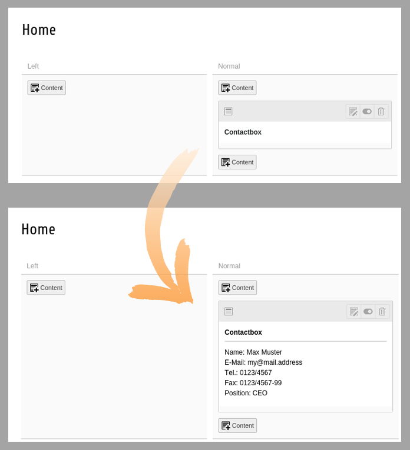

.. include:: ../Includes.txt

.. _backend-previews:

======================
Manage Backend Preview
======================

In the extension configuration you will find the setting :ref:`Folder for Backend Preview Templates<extension-settings-backend-templates>`.
If you want to change the look of the content elements in the TYPO3 backend page module, create a HTML file with the
same name as for the frontend template. For example MyElement.html. It's a good idea to copy the frontend template and
modify it for your needs.

.. code-block:: html

   Example code:
   Name: {data.tx_mask_name} 
   E-Mail: {data.tx_mask_email} 
   Tel.: {data.tx_mask_telephone} 
   Fax: {data.tx_mask_fax} 
   Position: {data.tx_mask_position}

   The backend preview reveals the content of the element

Preview for content field types
===============================

You can use a core ViewHelper to show an edit icon for every child element:

.. code-block:: html

      <html xmlns:be="http://typo3.org/ns/TYPO3/CMS/Backend/ViewHelpers">

      <f:for each="{data.tx_mask_mycontent}" as="data_item">
          <be:link.editRecord uid="{data_item.uid}" table="tt_content">
              <core:icon identifier="actions-open" size="small" /> Edit record
          </be:link.editRecord> 
      </f:for>

Preview image for a content element
===================================

Besides setting a FontAwesome Icon for you content element, you can also provide a custom preview image. This can be
done by placing a 32x32 pixel png image or svg graphic into the :ref:`specified<extension-settings-backend-preview>`
folder for preview images. The name of the image has to be the key of your element. For example my_element.png or
my_element.svg. Ideally this should be a screenshot of your element or a nice icon. It will be shown in the new
contentelement wizard and as the preview icon in the backend.
