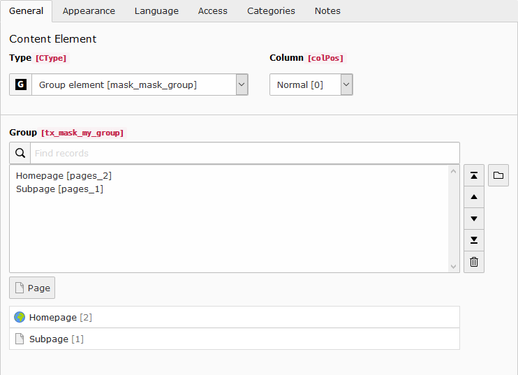

.. include:: ../../Includes.txt

============================
TCA type group now available
============================

As people create more complex elements with mask the demand increased for the
TCA group field. Groups are used to select database records from specified
tables. It is very similar to select fields with foreign_table specified, but
has some additional features. You have to enter a valid database table and
that's it.

.. figure:: ../../Images/Mask6/mask-group.png
   :class: with-border
   :alt: Mask group element

   Mask group element

   Rendered group in element

Relations of group and select fields are resolved now
=====================================================

Previously only a comma list was provided in the data array. Developers had to
write custom DataProcessors or ViewHelpers to get the result they needed. Now an
additional entry with the suffix "_items" in the array is provided with the
resolved database entries.

.. figure:: ../../Images/Mask6/group-resolving.png
   :alt: Debug data

   Debug data
