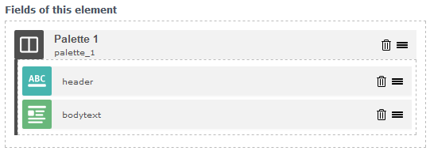
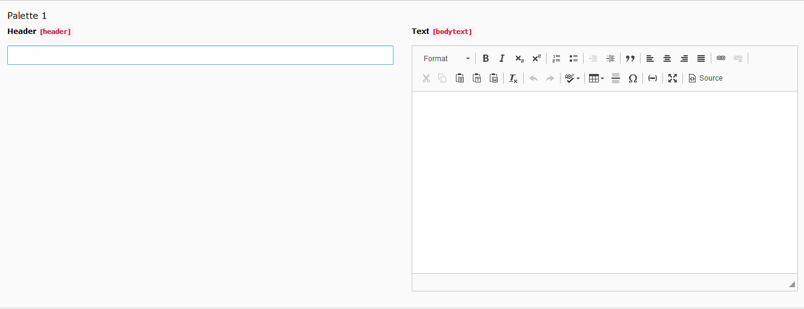
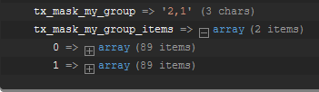
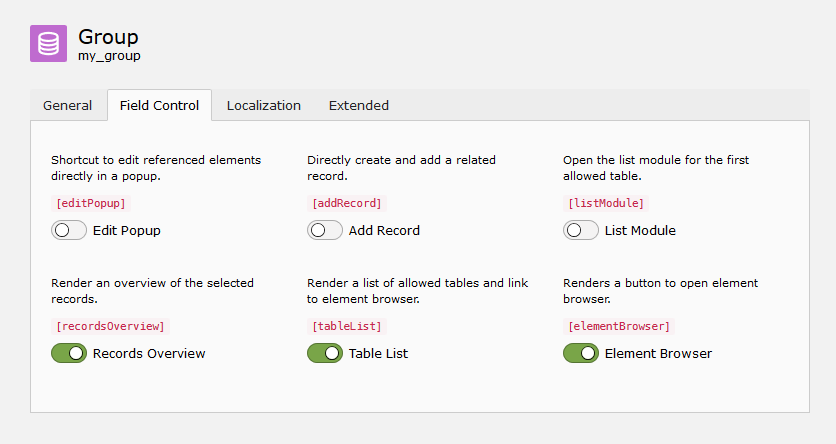

==============
Mask version 6
==============

Mask had a very long way. With the first alpha version released on the
12th August 2015 one of the most popular additions to TYPO3 entered the TER.
Back then the current LTS version of TYPO3 was 6.2 and now, 4 versions later,
Mask still supports the latest LTS 10.4 thanks to sponsors and volunteers.
The early idea to stay close to the core payed off big time! Updates with mask
are easy peasy and the mask.json can be used across multiple versions.

Nevertheless, a bit of dust has gathered over the years. Many TCA options have
changed, lots of old issues were never resolved and some frequently requested
features were never implemented. This changes with Mask version 6!

Group fields with palettes
==========================

Palettes are a very old concept in TYPO3 which allow you to group fields. These
fields are shown next to each other instead of each in a new line. It is
possible to add a manual break with the linebreak instruction.

The element builder comes now with the palette and linebreak fields. You can
drag in normal fields into the palette like you would do with inline fields.
The only thing you have to enter into the palette is the key and a label.
Fields in the palette will appear next to each other, when you edit the element.

Linebreaks
__________

Linebreaks can be used to add a manual newline. Use this if you want to keep the
grouping of fields, but there is not enough horizontal space left.

.. figure:: ../../Images/Mask6/linebreak-builder.png
   :alt: Linebreak in the mask element builder

.. figure:: ../../Images/Mask6/linebreak-in-element.png
   :alt: Rendered linebreak in element

TCA type group now available
============================

As people create more complex elements with mask the demand increased for the
TCA group field. Groups are used to select database records from specified
tables. It is very similar to select fields with foreign_table specified, but
has some additional features. You have to enter a valid database table and
that's it.

.. figure:: ../../Images/Mask6/mask-group.png
   :alt: Mask group element

.. figure:: ../../Images/Mask6/mask-group-element.png
   :alt: Rendered group in element

Relations of group and select fields are resolved now
_____________________________________________________

Previously only a comma list was provided in the data array. Developers had to
write custom DataProcessors or ViewHelpers to get the result they needed. Now an
additional entry with the suffix "_items" in the array is provided with the
resolved database entries.

Timestamp field to the rescue
=============================

Without going in too much detail, the normal date and datetime fields, which
store dates as DATE types in the database, can show wrong dates. This has to do
with a lot of back and forth timezone conversion. For this reason the new field
timestamp has been introduced, which stores dates as unix timestamps. In order
to avoid wrong dates, use timestamp from now on. Old date and datetime fields
are preserved for backwards compatibility.

For more technical insight read: `Date and DateTime saves wrong date <https://github.com/Gernott/mask/issues/234#issuecomment-653574022>`_

.. figure:: ../../Images/Mask6/timestamp.png
   :alt: Timestamp element

Improved checkbox UI
====================

Mask uses now the visuals of the TYPO3 slider checkboxes. This makes them easier
to select and the backend appears more structured. In addition the real tca
option name is shown above all fields.

Icons for select
================

It is now possible to use the third and fourth option of select items to provide
custom icons and descriptions.

.. figure:: ../../Images/Mask6/select-icons1.png
   :alt: 2 new options for items

.. figure:: ../../Images/Mask6/select-icons2.png
   :alt: Rendered icons in element

Better selection of existing fields
===================================

Some fields are not supposed to be reused, because they appear in other tabs of
the element. These have been removed now. In addition mask fields are now
grouped in the selection.

.. figure:: ../../Images/Mask6/existing-fields.png
   :alt: Grouped existing fields

Opt out of image cropping
=========================

The file field now has the option to remove the image cropping options. This is
useful, if there should be only pdf files for example.

.. figure:: ../../Images/Mask6/image-cropping.png
   :alt: Disable image cropping

New translation option allowLanguageSynchronisation
===================================================

The allowLanguageSynchronisation option has been added for all fields. This
allows you to select between three options:

- Copy from default language
- Copy from source language
- Set own value

Read more in TYPO3 docs: `Feature: #79658 <https://docs.typo3.org/c/typo3/cms-core/master/en-us/Changelog/8.6/Feature-79658-SynchronizedFieldValuesInLocalizedRecords.html>`_

Translation options for inline fields on by default
===================================================

Some translation options for inline, file and content fields are enabled by
default now as they would be turned on most of the time.

Improved html generation
========================

The generated html files are now formatted properly with 4 spaces and correct
indentation. Checkboxes are converted to fluid variables now.

And many, many bugfixes...

Technical improvements
======================

- Symfony DI
- Usage of the DefaultTcaSchema to automatically enrich database fields
- Many tests added
- Massive code cleanup (php-cs-fixer, rector)
- Refactoring of many methods
- JavaScript refactored to use Require JS

Breaking changes
================

- Removed AbstractCodeGenerator
- Removed JsonCodeGenerator
- The method "getFormType" has been extracted from FieldHelper to StorageRepository
- The method "sortInlineFieldsByOrder" has been extracted from WizardController to StorageRepository.
- Removed temp.mask.page TypoScript snippet
