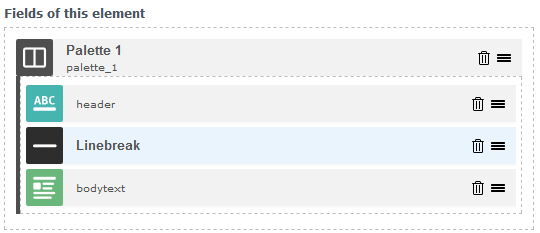
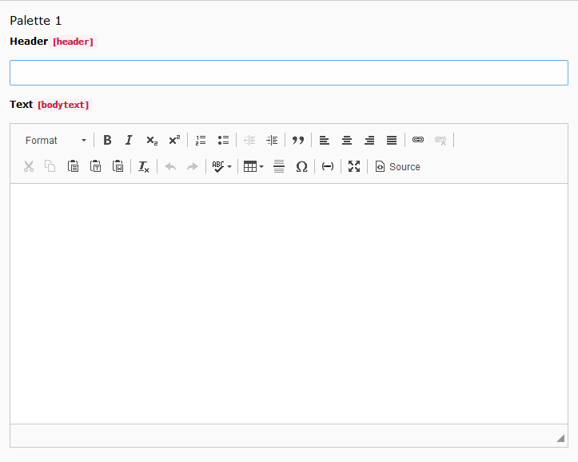
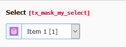
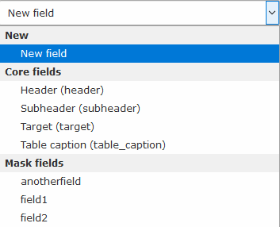

.. contents::
        :local:
        :depth: 1

==============
Mask version 6
==============

Mask had a very long way. With the first alpha version released on the
12th August 2015 one of the most popular additions to TYPO3 entered the TER.
Back then the current LTS version of TYPO3 was 6.2 and now, 4 versions later,
Mask still supports the latest LTS 10.4 thanks to sponsors and volunteers.
The early idea to stay close to the core payed off big time! Updates with mask
are easy peasy and the mask.json can be used across multiple versions.

Nevertheless, a bit of dust has gathered over the years. Many TCA options have
changed, lots of old issues were never resolved and some frequently requested
features were never implemented. This changes with Mask version 6!

.. contents::
        :local:
        :depth: 3

Group fields with palettes
==========================

Palettes are a very old concept in TYPO3 which allow you to group fields. These
fields are shown next to each other instead of each in a new line. It is
possible to add a manual break with the linebreak instruction.

The element builder comes now with the palette and linebreak fields. You can
drag in normal fields into the palette like you would do with inline fields.
The only thing you have to enter into the palette is the key and a label.
Fields in the palette will appear next to each other, when you edit the element.

.. figure:: ../../Images/Mask6/palette-builder.png
   :alt: Palette in the mask element builder

.. figure:: ../../Images/Mask6/palette-in-element.png
   :alt: Rendered palette in element

Linebreaks
__________

Linebreaks can be used to add a manual newline. Use this if you want to keep the
grouping of fields, but there is not enough horizontal space left.

TCA type group now available
============================

As people create more complex elements with mask the demand increased for the
TCA group field. Groups are used to select database records from specified
tables. It is very similar to select fields with foreign_table specified, but
has some additional features. You have to enter a valid database table and
that's it.

.. figure:: ../../Images/Mask6/mask-group-element.png
   :alt: Rendered group in element

Relations of group and select fields are resolved now
_____________________________________________________

Previously only a comma list was provided in the data array. Developers had to
write custom DataProcessors or ViewHelpers to get the result they needed. Now an
additional entry with the suffix "_items" in the array is provided with the
resolved database entries.

.. figure:: ../../Images/Mask6/group-resolving.png
   :alt: Debug data

Timestamp field to the rescue
=============================

Without going in too much detail, the normal date and datetime fields, which
store dates as DATE types in the database, can show wrong dates. This has to do
with a lot of back and forth timezone conversion. For this reason the new field
timestamp has been introduced, which stores dates as unix timestamps. In order
to avoid wrong dates, use timestamp from now on. Old date and datetime fields
are preserved for backwards compatibility.

For more technical insight read: `Date and DateTime saves wrong date <https://github.com/Gernott/mask/issues/234#issuecomment-653574022>`_

.. figure:: ../../Images/Mask6/timestamp.png
   :alt: Timestamp element

Improved checkbox UI
====================

Mask uses now the visuals of the TYPO3 slider checkboxes. This makes them easier
to select and the backend appears more structured. In addition the real tca
option name is shown above all fields.

.. figure:: ../../Images/Mask6/checkboxes.png
   :alt: New checkboxes

Icons for select
================

It is now possible to use the third and fourth option of select items to provide
custom icons and descriptions.

.. figure:: ../../Images/Mask6/select-icons1.png
   :alt: 2 new options for items

Better selection of existing fields
===================================

Some fields are not supposed to be reused, because they appear in other tabs of
the element. These have been removed now. In addition mask fields are now
grouped in the selection.

Opt out of image cropping
=========================

The file field now has the option to remove the image cropping options. This is
useful, if there should be only pdf files for example.

.. figure:: ../../Images/Mask6/image-cropping.png
   :alt: Disable image cropping

New translation option allowLanguageSynchronisation
===================================================

The allowLanguageSynchronisation option has been added for all fields. This
allows you to select between three options:

- Copy from default language
- Copy from source language
- Set own value

Read more in TYPO3 docs: `Feature: #79658 <https://docs.typo3.org/c/typo3/cms-core/master/en-us/Changelog/8.6/Feature-79658-SynchronizedFieldValuesInLocalizedRecords.html>`_

Translation options for inline fields on by default
===================================================

Some translation options for inline, file and content fields are enabled by
default now as they would be turned on most of the time.

Improved html generation
========================

The generated html files are now formatted properly with 4 spaces and correct
indentation. Checkboxes are converted to fluid variables now.

Bugfixes
========

This is a list of all bugfixes since version 5: ::

   2020-10-05 [BUGFIX] Display bodytext core field always as richtext (Commit d65e2e0 by Nikita Hovratov)
   2020-10-02 [BUGFIX] Fix missing labels for pages fields (Commit 24fc75e by Nikita Hovratov)
   2020-09-28 [BUGFIX] Show "includePrefixOption" only for text fields (Commit 824e2ab by Nikita Hovratov)
   2020-09-28 [BUGFIX] Allow removing field and use same key as before in element (Commit 62f8491 by Nikita Hovratov)
   2020-09-28 [BUGFIX] Unset some update suggestion keys that cause errors (Commit 023f813 by Nikita Hovratov)
   2020-09-28 [BUGFIX] Remove new lines of description in element wizard (Commit ef40fcf by Nikita Hovratov)
   2020-09-28 [BUGFIX] Fix getLabel if core field is already in palette (Commit e62e042 by Nikita Hovratov)
   2020-09-25 [BUGFIX] Update label and key sync after focusout event (Commit 34a4780 by Nikita Hovratov)
   2020-09-25 [BUGFIX] Fix sorting of repeating elements in workspace (Commit 6963b0c by Nikita Hovratov)
   2020-09-25 [!!!][BUGFIX] Always sort inline fields by order when fetching them (Commit 7b69cc0 by Nikita Hovratov)
   2020-09-25 [BUGFIX] Restrict FluidTemplate data override to pages (Commit b57cefb by Nikita Hovratov)
   2020-09-25 [BUGFIX] Remove wrong extra comma in unset argument list (Commit 4cf9a8e by Nikita Hovratov)
   2020-09-25 [BUGFIX] Add workspace restriction for inline tables (Commit abc3be3 by Nikita Hovratov)
   2020-09-24 [BUGFIX] Do not allow having Content fields with same key (Commit 4072731 by Nikita Hovratov)
   2020-09-24 [BUGFIX] Fix getFieldType for mask inline tables (Commit 1d7b4f6 by Nikita Hovratov)
   2020-09-24 [BUGFIX] Fix css on chrome (Commit 4ca640c by Nikita Hovratov)
   2020-09-23 [BUGFIX] Fix getFieldType method if elementKey is set (Commit 497ed16 by Nikita Hovratov)
   2020-09-23 [BUGFIX] Fix html code generation for palette fields (#355) (Commit 26741b5 by Nikita Hovratov)
   2020-09-23 [BUGFIX] Only show existing fields that are not used otherwise (Commit d56672d by Nikita Hovratov)
   2020-09-22 [BUGFIX] Check if field exists in tca before merging (Commit 9860df9 by Nikita Hovratov)
   2020-09-22 [BUGFIX] Fix element key check (Commit 59d084e by Nikita Hovratov)
   2020-09-22 [BUGFIX] Disallow palettes to have the same key as inline fields (Commit bd2e3da by Nikita Hovratov)
   2020-09-21 [BUGFIX] Fix sorting when new element is added (Commit 005128c by Nikita Hovratov)
   2020-09-14 [BUGFIX] Check if inline fields have children before inserting (Commit f181e65 by Nikita Hovratov)
   2020-09-14 [BUGFIX] Fix function call (Commit 8241a98 by Nikita Hovratov)
   2020-09-13 [BUGFIX] Fix styling for mobile view (Commit c8a14c5 by Nikita Hovratov)
   2020-07-18 [BUGFIX] Show error messages as red notifications (Commit 00b1166 by Nikita Hovratov)
   2020-07-17 [BUGFIX] Correct field name in index and show database update result (Commit ae450f0 by Nikita Hovratov)
   2020-07-17 [BUGFIX] Prevent errors of non existing tables (Commit 82903ce by Nikita Hovratov)

This list has been created by using `git log v5.1.3..v6.0.0 --abbrev-commit --grep='BUGFIX'  --pretty='%ad %s (Commit %h by %an)' --date=short`.

Technical improvements
======================

- Symfony DI
- Usage of the DefaultTcaSchema to automatically enrich database fields
- Many tests added
- Massive code cleanup (php-cs-fixer, rector)
- Refactoring of many methods
- JavaScript refactored to use Require JS

Breaking changes
================

- Removed AbstractCodeGenerator
- Removed JsonCodeGenerator
- The method "getFormType" has been extracted from FieldHelper to StorageRepository
- The method "sortInlineFieldsByOrder" has been extracted from WizardController to StorageRepository.
- Removed temp.mask.page TypoScript snippet
