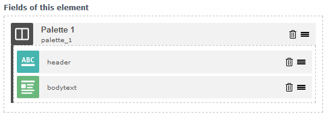
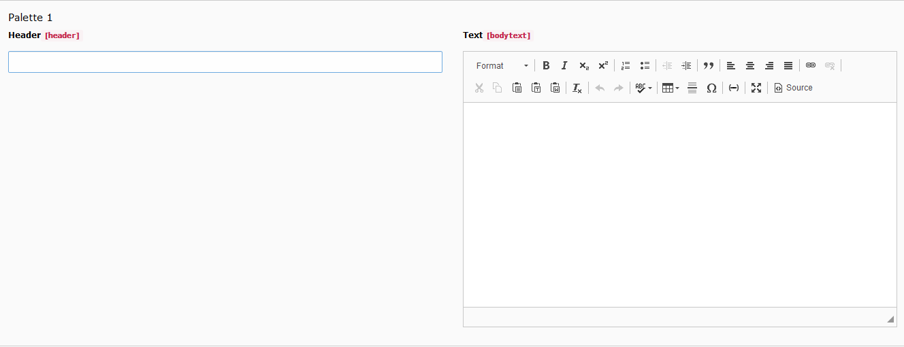
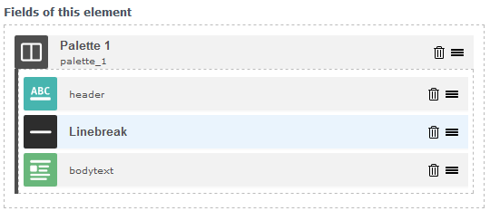
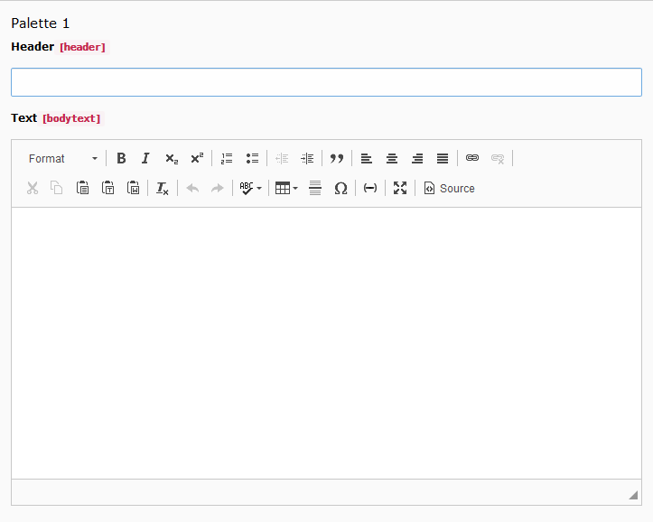

.. include:: ../../Includes.txt

==========================
Group fields with palettes
==========================

Palettes are a very old concept in TYPO3 which allow you to group fields. These
fields are shown next to each other instead of each in a new line. It is
possible to add a manual break with the linebreak instruction.

The element builder comes now with the palette and linebreak fields. You can
drag in normal fields into the palette like you would do with inline fields.
The only thing you have to enter into the palette is the key and a label.
Fields in the palette will appear next to each other, when you edit the element.

   Palette in the mask element builder

   Rendered palette in element

Linebreaks
==========

Linebreaks can be used to add a manual newline. Use this if you want to keep the
grouping of fields, but there is not enough horizontal space left.

   Linebreak in the mask element builder

   Rendered linebreak in element
