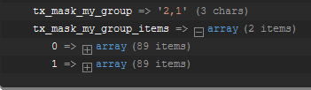

.. include:: ../../Includes.txt

=====================================================
Relations of group and select fields are resolved now
=====================================================

Previously only a comma list was provided in the data array. Developers had to
write custom DataProcessors or ViewHelpers to get the result they needed. Now an
additional entry with the suffix "_items" in the array is provided with the
resolved database entries.

   Debug data
