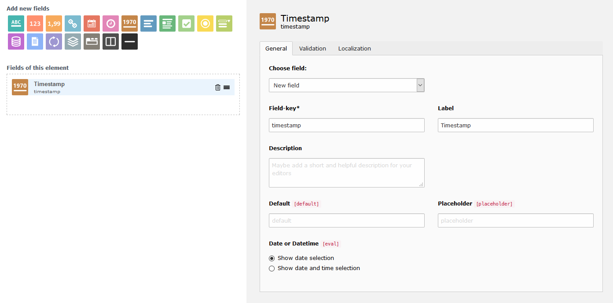

.. include:: ../../Includes.txt

=============================
Timestamp field to the rescue
=============================

Without going in too much detail, the normal date and datetime fields, which
store dates as DATE types in the database, can show wrong dates. This has to do
with a lot of back and forth timezone conversion. For this reason the new field
timestamp has been introduced, which stores dates as unix timestamps. In order
to avoid wrong dates, use timestamp from now on. Old date and datetime fields
are preserved for backwards compatibility.

For more technical insight read: `Date and DateTime saves wrong date <https://github.com/Gernott/mask/issues/234#issuecomment-653574022>`_

   Timestamp element
