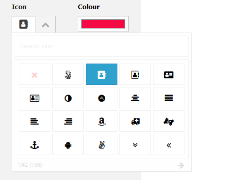
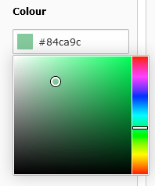

.. include:: ../../Includes.txt

=============================
Updated Icon and Color Picker
=============================

Updated icon picker
===================

The jQuery fontIconPicker got an upgrade to `version 3 <https://github.com/fontIconPicker/fontIconPicker>`__. This
brings a new feature: Filter by category.

   The new filter by category drop down

New color picker
================

Mask uses now the color picker of TYPO3: `jQuery Minicolors <https://github.com/claviska/jquery-minicolors>`__. This
unifies the user experience. Before the native browser color picker was used, which has different features depending
on your browser. You can now copy and paste a HEX value directly into the color picker.

   The new color picker
