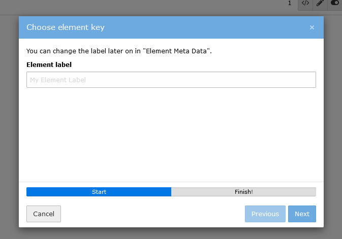

.. include:: ../../Includes.txt

===============================
Wizard for new content elements
===============================

By clicking on `Create new content element` a new wizard pops out, which guides you through some mandatory fields. First
you can choose a label for your element. In the next step you can either accept the auto-generated key or edit it. These
steps are completely optional and you can leave them initially blank. At the latest when you want to save your element
these fields have to be set. You can switch to the `Element Meta Data` tab anytime and edit your label and key.

   The Multi Step Wizard guides you through mandatory fields

.. note::
   The MultiStepWizard component of TYPO3 is used for this. In TYPO3 v10 it has some weird behaviour, which is fixed in
   TYPO3 v11. This is the reason why it's not allowed to go to the previous step.
