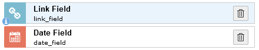
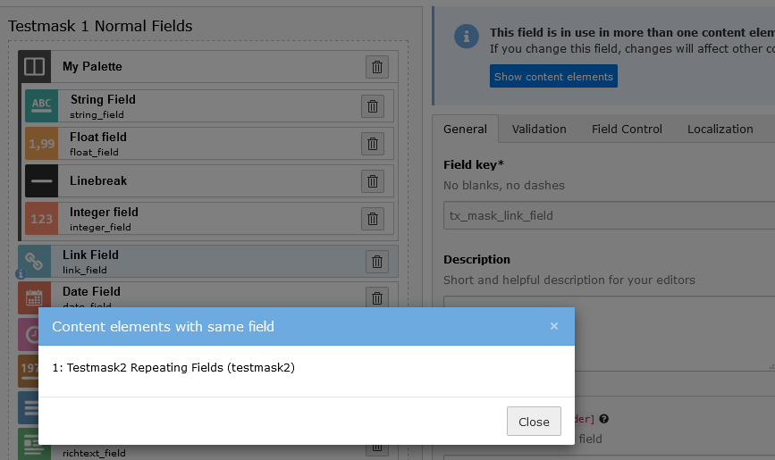

.. include:: ../../Includes.txt

========================
Improved Reusable fields
========================

You can see directly, if you are using a shared field in the field list now. It is indicated by a blue info dot.

   Shared fields are indicated by a blue info dot

The info message that you are using a shared field appears now at the top of the form instead of the bottom. By clicking
on the `Show content elements` button, a modal appears which lists all of the elements that share this field. This is
especially useful if you have a lot of elements which share the same fields.

   The multi use modal lists all of the elements that share the current field

When you select a shared field from the `Choose field` dropdown, all settings are loaded directly into the current
field. This way you can directly inspect the settings of the chosen shared field.
