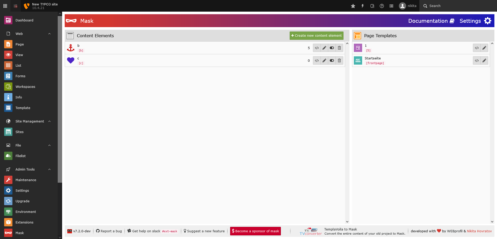
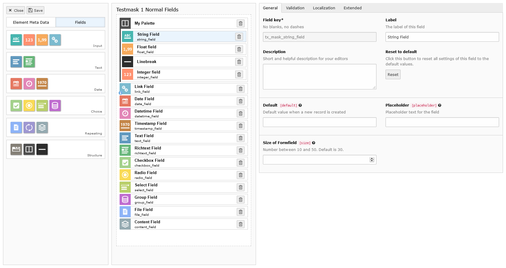

.. include:: ../../Includes.txt

==============
New appearance
==============

Mask comes now with a complete redesign of the backend module. Everything is optimized to get things done as fast as
possible. Due to the efficient usage of the available space, the content element list and the page template list fit
beside each other. You probably won't need to scroll as much as you used to have.

The button `Create new content element` is now always reachable. In the footer you can find helpful links like a direct
link to the github issue tracker.

   The redesigned Mask Backend

Responsive design
=================

The whole Mask module is completely responsive now and can be used with any monitor size.

   The redesigned Mask Backend fits on any screen

Mask Builder
============

Also the Mask Builder got a refresh in its look and usability. The fields are now again on the left side like it used to
be in version 4 and below. It is more ergonomic to drag from left to right as from top to bottom. If you have a very
long content element and you need to scroll down to see all fields, the left sidebar and the field form stick to the top
of your screen now. The fields are now structured by type for easier access.

   Restructure of the Mask Builder

Improved field form
-------------------

The form to the right where you can edit your fields now complies to the TYPO3 styleguide. The unneded icon and label
at the top are gone to free more space. In general unused whitespace is used more efficient.

The new sidebar
---------------

To make everything fit into the view, the element meta data (label, key, icon, ...) had to be hidden behind a new tab.
Now you can switch between fields and element data by clicking on the new tab buttons. You probably will only need to
edit the element meta data once, so this won't interrupt your workflow too much.

The save button has moved to the top left corner and the `Save and close` button is gone for good. Sticking to the
philosophy of the TYPO3 backend: only one function per button. Instead there is now a pure close button.

.. figure:: ../../Images/ContentelementsManual/ElementMetaData.png
   :alt: Element Meta Data
   :class: with-border

   The element meta data now hidden behind a tab
