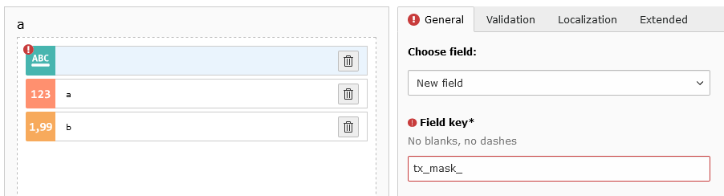
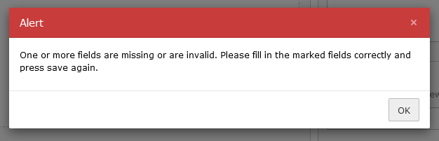

.. include:: ../../Includes.txt

===================
Improved validation
===================

The validation in the Mask Builder has improved a lot. You can immediately see, if one of your fields has an error.
Fields are marked with a red dot, which indicates there is something wrong and you should fix it.

   The Mask Builder shows you if fields have an error

If you try to save with errors, an alert pops up and instructs you to fix your errors. After clicking ok, the active
field changes to the first field having an error.

   An error alert appears if trying to save with errors
