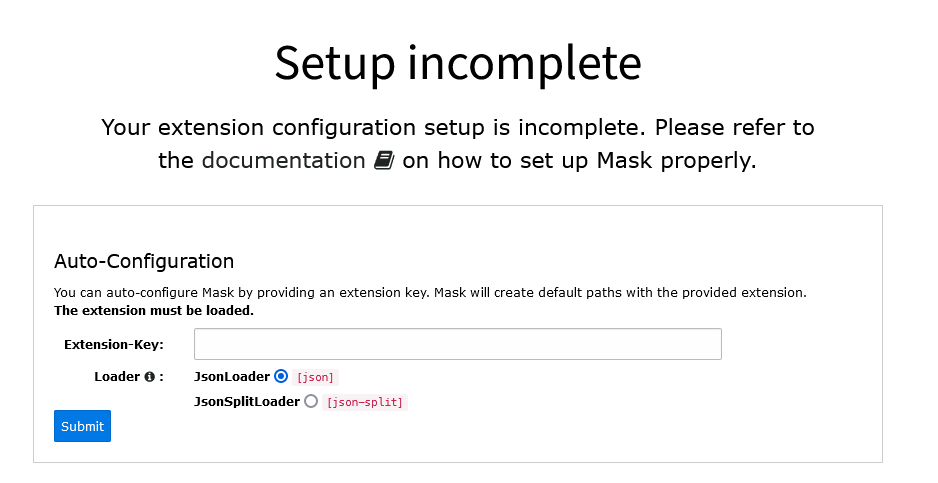
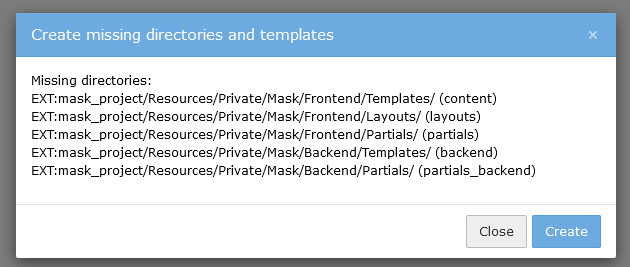
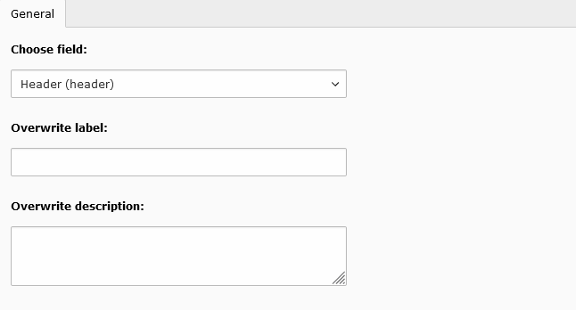
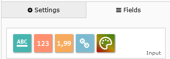

.. include:: ../../Includes.txt

================
Mask version 7.1
================

As promised, new good stuff will come in the v7 series. Now, let me introduce
you Mask `v7.1`! The focus of this version was to implement a proper API for
Mask. For this, lots of refactoring had to be done and many tests had to be
written (11k deleted lines!):

`git diff v7.0.19 main --shortstat`

.. code-block:: shell

   196 files changed, 20536 insertions(+), 11386 deletions(-)

The key features are thereby the new :php:`LoaderInterface` and the
:php:`TableDefinitionCollection`. Both will be explained more in detail later.
The other great thing is the improved first-time setup experience. The keyword
here: **Auto-Configuration**.

Now let's dive into the new greatness.

JsonSplitLoader
===============

With the new :php:`LoaderInterface` it is possible to create own Loaders. The
job of a Loader is to retrieve and persist Mask configuration. Mask always
stored the configuration into a single mask.json file. This is now the so called
:php:`JsonLoader`, which is used by default. As an alternative, Mask now
provides a second Loader, the :php:`JsonSplitLoader`. This Loader is capable of
splitting the configuration into multiple smaller json files. Each file contains
the entire configuration needed for a single content element. This means it is
independent of all other files. Hence, it can be copied over to other projects.
This also helps greatly with versioning, as new elements are way easier to see
in the history and changes can be pointed directly to the according content
elements.

Read more about the :ref:`new loaders <loader>`.

.. note::

   When copying files over to other projects, take care to not introduce
   duplicated field keys. Mask will not warn you, because it will interpret it
   as shared keys. This will be improved in the future.

TableDefinitionCollection
=========================

The new :php:`TableDefinitionCollection` class is the representation of the
entire Mask configuration. It consists of many other sub-configuration classes
like :php:`TcaDefinition` or :php:`SqlDefinition`. It completely replaces the
handling of the configuration as an array. There are many upsides in using
objects as configuration models: type safety, default values and auto-completion
in IDEs. Also, it is processed much faster than arrays.

This was an important part in implementing the new :php:`JsonSplitLoader`, too.
The Loaders can only deal with this type of object. And this is good.

You can use this API by injecting the class directly in the constructor. It is
registered as a service and will be retrieved by the :php:`LoaderRegistry` in
the DI cache.

.. code-block:: php

   public function __construct(TableDefinitionCollection $tableDefinitionCollection) {

Alternatively you can directly call :php:`LoaderRegistry->loadActiveDefinition()`

.. code-block:: php

   $loaderRegistry = GeneralUtility::makeInstance(LoaderRegistry::class);
   $tableDefinitionCollection = $loaderRegistry->loadActiveDefinition();

Auto-Configuration
==================

When loading the Mask module, Mask will now check for valid extension
configuration. Previously, Mask would allow you to open the Element-Builder,
despite missing configuration. This would result in an error while saving.

   Mask warns you about missing configuration

For the Auto-Configuration you need to provide a loaded extension's key. Then
you can choose between the two available Loaders. Upon submitting the form,
Mask will create the necessary configuration in your LocalConfiguration file.
The paths will also be created for you.

Missing directories and templates
=================================

Maybe you have seen the yellow button next to the "create new" button at some
point. It told you, that you have missing files or directories and would create
them for you by clicking on it. This button will now first show you all the
missing resources in a modal and you can accept by clicking on "create".

   Mask lists all missing directories

Description Overrides
=====================

Just like with labels, it is now possible to override description fields of core
fields and other mask fields.

   New field for description overrides

Internally Mask now uses the TCA :php:`overrideChildTca` option for overriding
descriptions and labels. This did fix a lot of issues with labels not appearing
in different contexts.

Thanks to Can Karadağ for this new feature.

ConvertFormat command
=====================

The new ConvertFormat command can be used to convert from one format into
another. This means, you can migrate your single mask.json file into many
split json files.

Example:

.. code-block:: shell

   > vendor/bin/typo3 mask:convert json json-split

   // or with typo3 console
   > vendor/bin/typo3cms mask:convert json json-split

   // Persist your current format (E.g. for updating after TYPO3 upgrade)
   > vendor/bin/typo3 mask:convert json

More new features
=================

*  New colorpicker field
*  selectIcons option for select (Thanks to Can Karadağ)
*  Improved drag validation in Mask builder (Thanks to Can Karadağ)
*  Palette descriptions (only v11)
*  Removed last extbase usage in backend context (Mask is now extbase-free)

   The new colorpicker field

Deprecations
============

In order to streamline the field type resolving, a small change had to be
introduced for richtext fields. This only affects installations, which were
originally created on TYPO3 v7 / Mask v2 or lower. Please check the Upgrade
module, if your installation needs to run an Upgrade Wizard. There is a
compatibility layer, so nothing will break if you ignore it.

Read more in the :ref:`Upgrade Guide <upgrade>`.

A lot of methods have been moved from :php:`StorageRepository` into :php:`TableDefinitionCollection`.
The following methods are now deprecated:

*  :php:`\MASK\Mask\Domain\Repository\StorageRepository->loadField()`
*  :php:`\MASK\Mask\Domain\Repository\StorageRepository->loadInlineFields()`
*  :php:`\MASK\Mask\Domain\Repository\StorageRepository->loadElement()`
*  :php:`\MASK\Mask\Domain\Repository\StorageRepository->getFormType()`
*  :php:`\MASK\Mask\Domain\Repository\StorageRepository->getElementsWhichUseField()`
*  :php:`\MASK\Mask\Domain\Repository\StorageRepository->findFirstNonEmptyLabel()`
*  :php:`\MASK\Mask\Domain\Repository\StorageRepository->getLabel()`
*  :php:`\MASK\Mask\Domain\Repository\StorageRepository->getFieldType()`

The :php:`MASK\Mask\Helper\FieldHelper` class is now deprecated.

Extensions
~~~~~~~~~~

When using `EXT:` paths in the extension configuration, the extension pointed to
must be loaded. If it is not loaded a deprecation warning will be logged. This
backwards-compatibility layer will be removed in Mask v8.

Thank you
=========

Thanks again to all Mask users, who are providing helpful issues and help
others on slack.

A special thanks goes to Can Karadağ, who actively approached me and implemented
the "Override Description" feature, the "Improved drag validation" feature and
the "selectIcons option for select" feature. He also helped a lot with testing
the new version.

Sponsoring
==========

Maintaining Mask and implementing new features takes a lot of effort. Help the
further development of Mask by donating any amount to `Nikita Hovratov <https://www.paypal.com/donate/?hosted_button_id=H2BYU35VHSGFY>`_ (me).
