.. include:: ../../Includes.txt

================
Mask version 7.2
================

The new Mask version 7.2 comes with incredibly lot of new features. The
groundwork has been laid in the previous two versions. It is now almost a breeze
to implement new features with VueJs and a real API for Mask definitions. Also
new contributors added some features, thanks!

.. contents::
   :local:

New field types
===============

Let's start with the most exciting ones: new fields. Three new field types are
added to the palette: Slug, Category and Media.

Slug
----

The :ref:`slug <fields-slug>` field can be used to create a unique identifier based on another field.
This identifier can be used to create speaking anchor links (fragments). With
core functionality it is unfortunately not possible to link to those fragments.

Thanks to Can Karadağ for the contribution.

Category
--------

TYPO3 v11 introduced the new TCA type :ref:`category <fields-category>`. This can be seen as a shortcut
for the type select renderType `selectTree` with the `foreign_table` set to
`sys_category`. It is possible to define the relation as `manyToMany`
(default), `oneToMany` or `oneToOne`. Mask resolves the category records
in the frontend automatically, so you can just start using them.

`Read more #94622 <https://docs.typo3.org/c/typo3/cms-core/main/en-us/Changelog/11.4/Feature-94622-NewTCATypeCategory.html>`__

Media
-----

The :ref:`media <fields-media>` type is, just like type file, a file reference field. The only
difference is the default allowed list being the media file extension list from
the core. In addition, you can decide which online media helpers should be
available (youtube, vimeo). You can also disable the upload by media URL
completely with the new option `fileByUrlAllowed`.

Module for managing item fields
===============================

To be honest, adding items to select, radio and checkboxes was always a pain.
Making sure your csv is in correct order is mundane. Mask is your remedy! A
dedicated module enables you to comfortably configure your items inside a
table view. Adding, removing and moving items is as easy as adding new fields
now.

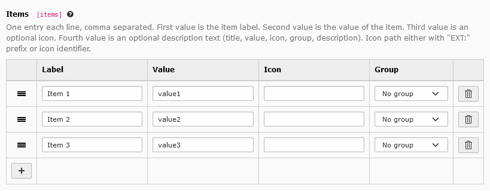

   The items module helps you add, move and remove items

CType selection as multiple side by side
========================================

Wasn't it annoying not being able to change the first cType item for a type
Content field? For me it was. So I created a similar module like the good old
SelectMultipleSideBySide from TYPO3. It is possible to drag the items between
the two lists or by clicking on them. Inside the selected list sorting of items
is enabled.

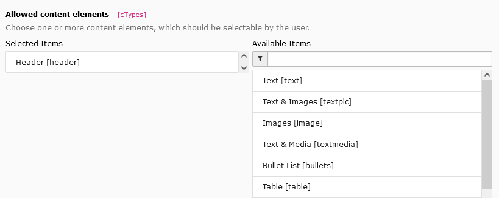

   Choose CType items by drag and drop or by clicking on them

`foreign_table` now selectable from defined TCA tables
======================================================

Instead of typing in the table name inside the `foreign_table` field, you can
now select your desired table from a drop-down list.

Thanks to Guido Schmechel (ayacoo) for the idea and implementation.

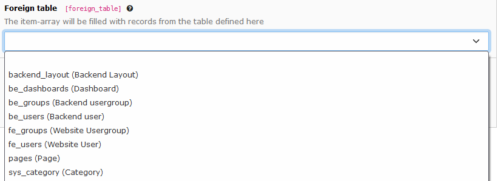

   The foreign_table field as a select

Available LinkHandler fetched from PageTS
=========================================

Instead of a static list of link handlers, Mask now fetches the list of
registered link handlers from the global PageTS config. This allows custom link
handlers to appear in the `blindLinkOptions` section of the Link field.

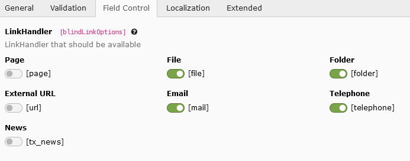

   Custom link handlers are now displayed in the list

:ref:`Read more about the LinkHandler API <t3coreapi:linkhandler>`

New TCA features implemented
============================

Mask tries to keep up with implementing all TCA features, old and new ones. This
is an ongoing task. As announced, it is getting easier to get things done and so
here comes the list of new TCA features:

Item grouping for TCA select items
----------------------------------

This feature is from TYPO3 v10. It introduced an API for grouping select items.
For select fields, you can now define one or more groups, which then can be
selected in the `items` field. Grouped fields are shown seperated from other
groups and allow to structure your options more easily.

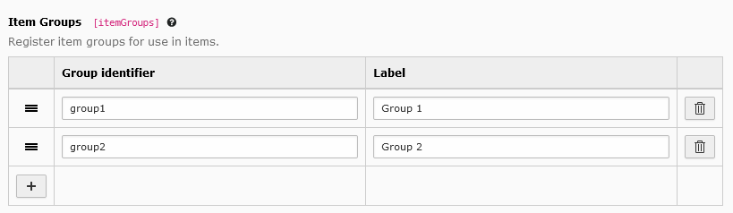

   Mask can manage now your item groups

`Read more #91008 <https://docs.typo3.org/c/typo3/cms-core/main/en-us/Changelog/10.4/Feature-91008-ItemGroupingForTCASelectItems.html>`__

Item sorting for TCA select items
---------------------------------

In addition to grouping, you can now also define a sorting order for your items.
Mask provides for this a nice module, where you can add and select a sorting
definition.

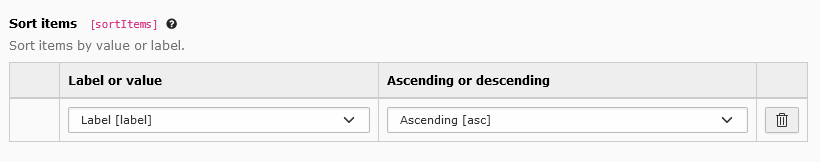

   Define the sorting order of your items

`Read more #91008 <https://docs.typo3.org/c/typo3/cms-core/main/en-us/Changelog/10.4/Feature-91008-ItemSortingForTCASelectItems.html>`__

`expandAll` option for selectCheckBox
-------------------------------------

This nifty little option allows in TYPO3 v11 to initially expand all groups.

`Read more #91859 <https://docs.typo3.org/c/typo3/cms-core/main/en-us/Changelog/11.0/Feature-91859-AllowSelectCheckBoxGroupsToBeInitiallyExpanded.html>`__

Support for more checkbox options
---------------------------------

TYPO3 supports some
:ref:`special configuration <t3tca:columns-check-properties-items>` for checkbox
items. The dedicated items module, as mentioned earlier, also supports these
options now, depending on the selected renderType.

ValuePicker
-----------

The well-known :ref:`value picker <t3tca:columns-input-properties-valuePicker>`
allows to create a list of pre-defined values, which can be added by the user
from a select field. Mask does now support this feature for its text-like
fields. You will find a new tab `Value Picker` containing this module.

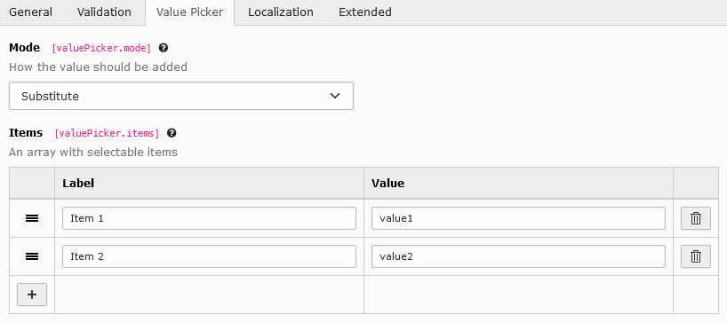

   A module for pre-defined values the user can pick from

Icon overlay for newContentElementWizard elements
-------------------------------------------------

In addition to the normal icon, TYPO3 v11 supports an additional `overlayIcon`.
This icon will be displayed as a smaller symbol on the bottom right corner of
the standard icon. Mask provides a second icon (and color) picker beneath the
normal one for this.

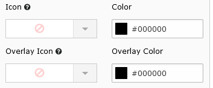

   A second icon and color picker for overlays

`Read more #92942 <https://docs.typo3.org/c/typo3/cms-core/main/en-us/Changelog/11.1/Feature-92942-AllowIconOverlayForNewContentElementWizardElements.html>`__

Quality of life changes
=======================

Search for Mask elements
------------------------

You will see a new search bar inside the content elements header. Use it for
filtering your custom content elements.

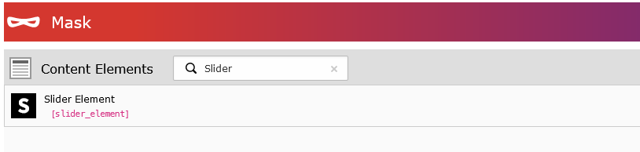

   A search bar for filtering content elements

Next with Enter key in New content element wizard
-------------------------------------------------

When you are finished typing in the label for your new content element, try to
press the enter key. This will take you immediately to the next slide without
the need to use the mouse!

The bodytext field as (plain) type text
=======================================

The good ol' core bodytext field was always treated as a richtext field by Mask.
It was not possible to select it as a normal type text field. This was and still
is a limitation of Mask: One type per field. To circumvent this, Mask now
provides an exception for the bodytext field in particular and allows to both
select it as type text and type richtext. Backwards compatibility is given.

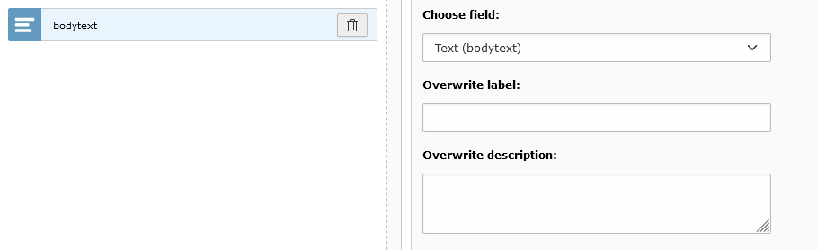

   The bodytext field can now be selected as plain text

Migration Manager
=================

The Mask json definition has a long history and while many things changed in
newer versions of Mask (and TYPO3), a whole heap of migrations were added to
stay compatible with older definitions. First of all, a meaningful API has been
added for migrations, called the MigrationManager. The MigrationManager will
convert your old definitions to an up to date version, if it is necessary. This
conversion can become resource-heavy as your elements increase in count. To
circumvent the performance loss, a new version number is now added to your
definitions. This version number is used to decide, whether a migration should
be triggered. If you visit the Mask backend, a notification will appear, in case
a migration has been done. An action button allows to update your definition
with just one click. Don't forget to add these changes to your VCS.

.. tip::

   You can also update your Mask definition via CLI:

   .. code-block:: shell

      vendor/bin/typo3 mask:convert

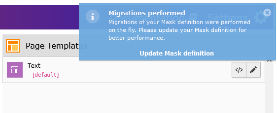

   An info notification appears, if migrations were performed

TYPO3 v11 deprecation free
==========================

Mask is now deprecation free in TYPO3 v11 in terms of TCA migrations. The
following migrations are done by Mask to mitigate deprecation log entries from
the core:

*  The new option :ref:`showNewRecordLink <t3tca:columns-inline-properties-showNewRecordLink>`
   has been added, while the former `levelLinksPosition` option with the value
   `none` is migrated to use this option.

*  The new option :ref:`fileFolderConfig <columns-select-properties-fileFolderConfig>`
   is now used instead of the old separate versions.

Bugfixes
========

*  If `null` is selected in the extended view, SQL fields now also allow :sql:`NULL` values
*  Paths both with and without trailing slash now allowed in all mask settings
*  Many, many more bugfixes already included in v7.1

Miscellaneous
=============

*  All select renderTypes are now resolved in the frontend
*  Parent record data (pages record) now available per default in the frontend
*  Added missing `default` option for type `Select`
*  Added `createNewRelationLinkTitle` option for type `File`
*  Added `elementBrowserEnabled` option for type `File`
*  Added `enabledControls` options for type `Inline` and `File`
*  Set `useSortable` as default to true for `Inline` and `File` fields, to enable drag and drop per default
*  Improved HTML code generation
*  The command :shell:`mask:convert` can now be called without arguments to persist your current definition
*  `saveAndClose` for content elements is now available in the settings

Documentation improvements
==========================

*  Help links now linked to TYPO3 v11 documentation
*  Aligned with new TYPO3 documentation standards (Thanks to Alexander Nitsche)
*  Improved README introduction
*  List all available TCA and custom options for fields

Technical improvements
======================

*  Added PHPStan static code analyzer to automatic testing (Level 6)
*  Switched from travis-ci to github actions
*  Removed usage of some leftover extbase classes
*  Switched to main as default branch

Deprecations
============

*  :php:`MASK\Mask\ViewHelpers\EditLinkViewHelper` -> Please use :html:`be:link.editRecord` instead
*  :php:`MASK\Mask\ViewHelpers\ContentViewHelper` -> Please use :html:`f:cObject` instead

Statistics
==========

`git diff v7.1.0 main --shortstat`

.. code-block:: shell

   249 files changed, 14697 insertions(+), 5244 deletions(-)

Credits
=======

Thanks for new and old contributors for this version:

*  Can Karadağ
*  Alexander Nitsche
*  Nitori (Sani)
*  Susanne Moog
*  Guido Schmechel (ayacoo)
*  Georg Ringer

Sponsoring
==========

Do you like the new version of Mask? You can now sponsor my (Nikita Hovratov)
free contribution to this project on `GitHub <https://github.com/sponsors/nhovratov>`__.
