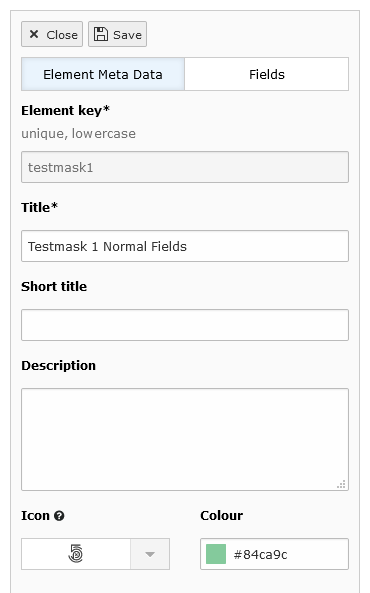

.. include:: ../Includes.txt

.. _create-content-elements:

=======================
Create content elements
=======================

After following the :ref:`installation <installation>` steps, you can start using Mask. Open the backend module
**Mask**. It is located right below the extension manager module.

New content element wizard
==========================

Create your first content element by clicking on the **Create new content element** button. Now a wizard appears, which
will guide you through some mandatory fields:

* `Label`: Enter the label for this content element. This is the name editors will see when creating the content
  element.

* `Key` (unique, lowercase): Your element needs a unique key. This key is used for the CType (Content Type), which is
  essential for defining the content element. Also the Fluid HTML templates will be generated with this name.

.. figure:: ../Images/ContentelementsManual/Wizard.png
   :alt: The Multi Step Wizard

   The Multi Step Wizard

After you have finished defining the label and the key, click finish and the Mask Builder will open.
By default the tab `Fields` will be opened.

.. figure:: ../Images/ContentelementsManual/MaskBuilder.png
   :alt: The Mask Content Element Builder

   The Mask Content Element Builder

Create fields
=============

Now you can fill your element with different fields. Look at the page :ref:`Fieldtypes<fieldtypes>` for more
information about all the different fieldtypes. Drag and drop your desired field into the dragarea in the middle of the
screen. It is also possible to just click on a field. In this case the field will be inserted beneath the current active
field. After doing so, a form will appear on the right side.

.. figure:: ../Images/ContentelementsManual/FieldForm.png
   :alt: Form of a field

   Form of a field

Analogous to the element key, you will have to come up with a unique key for your field. Your custom fields will always
have `tx_mask_` as a prefix, which you can not remove. This is important in order to avoid conflicts with existing
fields. You also have the possibility to use existing TYPO3 core fields or existing Mask fields in the `Choose field`
drop down.

Most fields have this options in common:

* `Field Key`: As described above the unique key for this field. A new column in the database table `tt_content` will be
  created with this exact name.
* `Label`: The label, which the editor will see when editing the content element. Can be a :ref:`localized string <t3coreapi:cgl-localization>`.
* `Description`: The description will be shown beneath the label. Here you can give your editor some more information on
  how to use this field.
* `Reset to default`: Resets all the TCA options like it would be when newly created (not label and description).

TCA settings
============

All other options relate to the according :ref:`TCA (Table Configuration Array)<t3tca:start>` options. The exact name of
the TCA option is shown in brackets and a small black circle with a question mark links directly to the TYPO3 docs.
TCA is used to define how the fields will be rendered and validated. There is a lot that can be done with TCA and of
course Mask has not adapted (yet) all of the available functionality, but for the most part it should be enough to
tackle day to day needs.

.. _content-elements-shared-reuse:
Share fields vs. override them
------------------------------

By default, Mask shares field configurations across content elements,
allowing you to selectively overwrite labels and descriptions for individual fields.
Starting from Mask v8.2, it became possible to override fields across different elements.
When this behavior is enabled in the extension settings, you gain the ability
to override nearly every setting for individual fields and utilize them across multiple elements.
For instance, consider a dropdown field that needs to be reused with various select options.
This behavior is particularly useful when you have numerous elements with diverse options
but prefer not to expand your database with an excessive number of fields.

Note that Core fields are always allowed to be overridden.

Even when you have enabled the reuse of fields, there are certain options in
TYPO3 which remain shared and cannot be overridden:

*  Category Field Relationship, Possible Options: oneToOne, oneToMany, manyToMany (TCA Key: `relationship`)
*  Select Field Database Options, `foreign_table`, `foreign_field`, `foreign_table_field`, `foreign_match_fields`
*  Group Field `allowed` in case of `internal_type=db`

Other internally used TCA Options that are not overwritten:

*  `type` (used for field type)
*  `dbType` (eg. datetime and date field)
*  `nullable`
*  `MM`
*  `MM_opposite_field`
*  `MM_hasUidField`
*  `MM_oppositeUsage`

Furthermore, it's important to note that repeating (inline) fields cannot be shared
and you are also not able to share different field types between each other (eg. text input and float have to be two fields).
If you are currently using Mask with shared fields but wish to switch to override shared fields,
you can find more information in the :ref:`8.2 changelog <migrateToReusingFields>` on how to migrate to override shared fields.

The Element Meta Data Tab
=========================

Switch to the tab `Element Meta Data`. This tab contains general information about your content element. If you already
defined a label and a key in the creation wizard, they will be shown here.

Besides the label and the key there are some further fields:

`Short Title`: The Short Title is used, if you edit an element and open the :ref:`selectbox <short-title>` for the
CType. If this field is empty, the title is used.

`Description`: It would be helpful to add a description for the editors. It appears in the wizard for creating new
content elements next to the title and the preview image.

`Icon`: If you quickly need a preview icon for your content element and you don't want to create an image, just choose
a fontawesome icon. You can select from different categories or search for a keyword. If you don't define any icon, a
fallback icon will be created with the first letter of your `label`.

`Color`: Choose a color for your icon.

.. rst-class::  clear-both

.. _short-title:

Short title in CType select
---------------------------

.. figure:: ../Images/ContentelementsManual/ShortTitle.png
   :alt: Short title in CType preview
   :class: with-border

   Short title in CType preview

FontIconPicker
--------------

.. figure:: ../Images/ContentelementsManual/Fontawesome.png
   :alt: FontAwesome icon picker
   :class: with-shadow

   Use a FontAwesome icon

Save the content element
========================

When ready, save your element with the save button on the top left corner. On first save, a HTML file with example fluid
code is generated and saved in your template folder path. Now you can change the structure of the HTML file like you
need it. Of course the full power of Fluid is available and all TYPO3 ViewHelper are ready to be used. This file will
never be overwritten, even if you change the element in Mask. If you need some fluid example code for newly added
fields, click the HTML icon of the element in the list view.

That is all you have to know - now you can use your new element in the page module.
