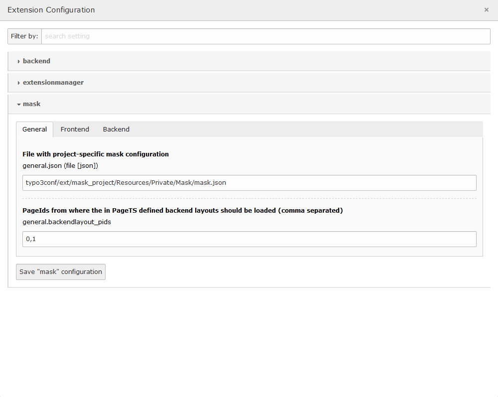

.. include:: ../Includes.txt

.. _extension-settings:

==================
Extension Settings
==================

These are the available settings for mask. They can be configured via the GUI in **Settings > Extension Configuration**
or directly in the AdditionalConfiguration.php like described in :ref:`installation <installation>`. If you don't change
any settings, a dummy extension `mask_project` will be created as fallback.

General
=======

.. _extension-settings-loader_identifier:

loader_identifier
_________________

| Can be either `json` or `json-split`.
| Defines which JsonLoader to use.
| Refer to the API documentation for more information.
| Default: `json`

.. _extension-settings-json:

json
____

| Only for JsonLoader.
| File with project specific mask configuration.
| Mask stores the information, which is needed to generate content elements and extend page templates into one file: `mask.json`. With this setting you can change the path to this file.
| Default: :code:`EXT:{your_sitepackage}/Configuration/Mask/mask.json`

.. _extension-settings-content_elements_folder:

content_elements_folder
_______________________

| Only for JsonSplitLoader
| Folder in which to save content element definitions.
| Default: `EXT:{your_sitepackage}/Configuration/Mask/ContentElements`

.. _extension-settings-backend_layouts_folder:

backend_layouts_folder
______________________

| Only for JsonSplitLoader
| Folder in which to save backend layout definitions.
| Default: `EXT:{your_sitepackage}/Configuration/Mask/BackendLayouts`

.. _extension-settings-pids:

backendlayout_pids
__________________

| Page ids from where the in PageTS defined backend layouts should be loaded (comma separated).
| Default: 0 (root-pid, all layouts are found)

Frontend
========

.. _extension-settings-frontent-templates:

content
_______

| Folder for Content Fluid Templates.
| Mask generates a html file with fluid tags for each new content element. Here you can set the path to this file.
| Default: :code:`EXT:{your_sitepackage}/Resources/Private/Mask/Frontend/Templates`

.. _extension-settings-frontent-layouts:

layouts
_______

| Folder for Content Fluid Layouts.
| Here you can set the path to the fluid layouts of your mask templates.
| Default: :code:`EXT:{your_sitepackage}/Resources/Private/Mask/Frontend/Layouts`

.. _extension-settings-frontent-partials:

partials
________

| Folder for Content Fluid Partials.
| Here you can set the path to the fluid partials of your mask templates.
| Default: :code:`EXT:{your_sitepackage}/Resources/Private/Mask/Frontend/Partials`

Backend
=======

.. _extension-settings-backend-templates:

backend
_______

| Folder for Backend Preview Templates.
| Here you can set the path the fluid templates for backend previews of your content elements.
| Default: :code:`EXT:{your_sitepackage}/Resources/Private/Mask/Backend/Templates`

.. _extension-settings-backend-layouts:

layouts_backend
_______________

| Folder for Backend Preview Layouts.
| Here you can set the path to the fluid layouts of your mask backend previews.
| Default: :code:`EXT:{your_sitepackage}/Resources/Private/Mask/Backend/Layouts`

.. _extension-settings-backend-partials:

partials_backend
________________

| Folder for Backend Preview Partials.
| Here you can set the path to the fluid partials of your mask backend previews.
| Default: :code:`EXT:{your_sitepackage}/Resources/Private/Mask/Backend/Partials`

.. _extension-settings-backend-preview:

preview
_______

| Folder for preview images.
| You can change the preview image of content elements to your preferred png image (32x32 pixel) or svg graphic.
| Store them with the key of the contentelement as filename (e.g. mykey.png or mykey.svg)
| Default: :code:`EXT:{your_sitepackage}/Resources/Public/Mask`
|

   Extension Configuration options in **Settings > Extension Configuration**
