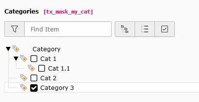

.. include:: ../../Includes.txt

.. _fields-category:

Category (only v11)
===================

.. figure:: ../../Images/FieldTypes/Category.svg
   :alt: Check
   :class: float-left
   :width: 64px

The category type creates relations to the system category (sys_category) table field.

.. rst-class::  clear-both

.. code-block:: php

   'type' => 'category'

   Category field

Available TCA options
---------------------

*  :ref:`config.default <t3tca:columns-check-properties-default>`
*  :ref:`config.relationship <t3tca:columns-category-properties-relationship>`
*  :ref:`config.treeConfig.startingPoints <t3tca:columns-category-properties-treeconfig>`
*  :ref:`config.minitems <t3tca:tca_property_minitems>`
*  :ref:`config.maxitems <t3tca:tca_property_maxitems>`
*  :ref:`config.exclusiveKeys <t3tca:columns-category-properties-exclusivekeys>`
*  :ref:`config.treeConfig.appearance.showHeader <t3tca:columns-category-properties-treeconfig>`
*  :ref:`config.treeConfig.appearance.expandAll <t3tca:columns-category-properties-treeconfig>`
*  :ref:`config.treeConfig.appearance.nonSelectableLevels <t3tca:columns-category-properties-treeconfig>`
*  :ref:`config.behaviour.allowLanguageSynchronization <t3tca:tca_property_behaviour_allowLanguageSynchronization>`
*  :ref:`config.size <t3tca:tca_property_size>`

See a complete overview of Category TCA options in the :ref:`official documentation <t3tca:columns-category>`.
