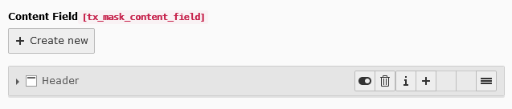

.. include:: ../../Includes.txt

.. _fields-content:

Content
=======

.. figure:: ../../Images/FieldTypes/Content.svg
   :alt: Content
   :class: float-left
   :width: 64px

Allow users to attach content elements to the content element itself. This way editors can nest the content elements and
can for instance build an accordion filled with already existing content elements.

.. rst-class::  clear-both

.. code-block:: php

   'type' => 'inline',
   'foreign_table' => 'tt_content'

   Content field

Available TCA options
---------------------

*  cTypes (custom Mask option used for :ref:`itemsProcFunc <t3tca:tca_property_itemsProcFunc>`)
*  :ref:`config.minitems <t3tca:tca_property_minitems>`
*  :ref:`config.maxitems <t3tca:tca_property_maxitems>`
*  :ref:`config.appearance.newRecordLinkTitle <t3tca:columns-inline-properties-appearance>`
*  :ref:`config.appearance.levelLinksPosition <t3tca:columns-inline-properties-appearance>`
*  :ref:`config.appearance.showNewRecordLink <columns-inline-properties-showNewRecordLink>` (only v11 or higher)
*  :ref:`config.appearance.collapseAll <t3tca:columns-inline-properties-appearance>`
*  :ref:`config.appearance.expandSingle <t3tca:columns-inline-properties-appearance>`
*  :ref:`config.appearance.useSortable <t3tca:columns-inline-properties-appearance>`
*  :ref:`config.appearance.enabledControls <t3tca:columns-inline-properties-appearance>`
*  :ref:`l10n_mode <t3tca:columns-properties-l10n-mode>`
*  :ref:`config.behaviour.allowLanguageSynchronization <t3tca:tca_property_behaviour_allowLanguageSynchronization>`
*  :ref:`config.appearance.showPossibleLocalizationRecords <t3tca:columns-inline-properties-appearance>`
*  :ref:`config.appearance.showAllLocalizationLink <t3tca:columns-inline-properties-appearance>`
*  :ref:`config.appearance.showSynchronizationLink <t3tca:columns-inline-properties-appearance>`

See a complete overview of Inline TCA options in the :ref:`official documentation <t3tca:columns-inline>`.
