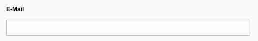

.. include:: ../../Includes.txt

.. _fields-email:

Email
=====

.. important::

   Only available for TYPO3 v12 or higher. For TYPO3 v11 or lower use type
   :ref:`String <fields-string>` with eval set to `email`.

.. figure:: ../../Images/FieldTypes/Email.svg
   :alt: Email
   :class: float-left
   :width: 64px

An input field validated for a correct email address.

.. rst-class::  clear-both

.. code-block:: php

   'type' => 'email'

   Email field

Available TCA options
---------------------

*  :ref:`config.default <t3tca:tca_property_default>`
*  :ref:`config.placeholder <t3tca:tca_property_placeholder>`
*  :ref:`config.size <t3tca:columns-email-properties-size>`
*  :ref:`config.eval.required <t3tca:columns-email-properties-eval>`
*  :ref:`config.eval.unique <t3tca:columns-email-properties-eval>`
*  :ref:`config.eval.uniqueInPid <t3tca:columns-email-properties-eval>`
*  :ref:`l10n_mode <t3tca:columns-properties-l10n-mode>`
*  :ref:`config.behaviour.allowLanguageSynchronization <t3tca:tca_property_behaviour_allowLanguageSynchronization>`
*  :ref:`config.eval.null <t3tca:columns-email-properties-eval>`
*  :ref:`config.mode <t3tca:tca_property_mode>`
*  :ref:`config.autocomplete <t3tca:columns-email-properties-autocomplete>`

See a complete overview of Email TCA options in the :ref:`official documentation <t3tca:columns-email>`.
