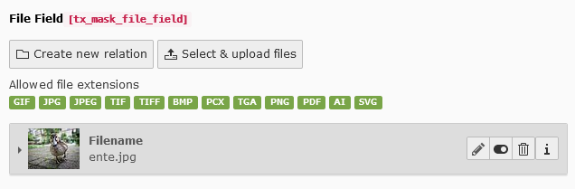

.. include:: ../../Includes.txt

.. _fields-file:

File
====

File field using :ref:`FAL<t3coreapi:using-fal>`.

.. rst-class::  clear-both

.. code-block:: php

   'type' => 'inline',
   'foreign_table' => 'sys_file_reference'

   File field

Available TCA options
---------------------

*  :ref:`imageoverlayPalette <columns-inline-examples-fal>` (custom Mask option, which enables the core TCA palette `imageoverlayPalette` used for images)
*  :ref:`config.minitems <t3tca:tca_property_minitems>`
*  :ref:`config.maxitems <t3tca:tca_property_maxitems>`
*  :ref:`allowedFileExtensions <t3tca:columns-group-properties-appearance>` (used in :ref:`overrideChildTca <columns-inline-properties-overrideChildTca>`)
*  :ref:`config.appearance.collapseAll <t3tca:columns-inline-properties-appearance>`
*  :ref:`config.appearance.expandSingle <t3tca:columns-inline-properties-appearance>`
*  :ref:`config.appearance.useSortable <t3tca:columns-inline-properties-appearance>`
*  :ref:`config.appearance.elementBrowserEnabled <t3tca:columns-inline-properties-appearance>`
*  :ref:`config.appearance.fileUploadAllowed <t3tca:columns-inline-properties-appearance>`
*  :ref:`config.appearance.createNewRelationLinkTitle <t3tca:columns-inline-properties-appearance>`
*  :ref:`config.appearance.enabledControls <t3tca:columns-inline-properties-appearance>`
*  :ref:`l10n_mode <t3tca:columns-properties-l10n-mode>`
*  :ref:`config.behaviour.allowLanguageSynchronization <t3tca:tca_property_behaviour_allowLanguageSynchronization>`
*  :ref:`config.appearance.showPossibleLocalizationRecords <t3tca:columns-inline-properties-appearance>`
*  :ref:`config.appearance.showAllLocalizationLink <t3tca:columns-inline-properties-appearance>`
*  :ref:`config.appearance.showSynchronizationLink <t3tca:columns-inline-properties-appearance>`

See a complete overview of Inline TCA options in the :ref:`official documentation <t3tca:columns-inline>`.
