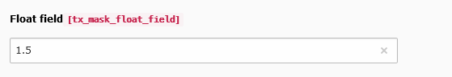

.. include:: ../../Includes.txt

.. _fields-float:

Float
=====

An input field for floats.

.. rst-class::  clear-both

.. code-block:: php

   'type' => 'input',
   'eval' => 'double2'

   Float field

Available TCA options
---------------------

*  :ref:`config.default <t3tca:tca_property_default>`
*  :ref:`config.placeholder <t3tca:tca_property_placeholder>`
*  :ref:`config.size <t3tca:columns-input-properties-size>`
*  :ref:`config.eval.required <t3tca:columns-input-properties-eval>`
*  :ref:`config.max <t3tca:columns-input-properties-max>`
*  :ref:`config.range.lower <t3tca:columns-input-properties-range>`
*  :ref:`config.range.upper <t3tca:columns-input-properties-range>`
*  :ref:`config.slider.step <t3tca:columns-input-properties-slider>`
*  :ref:`config.slider.width <t3tca:columns-input-properties-slider>`
*  :ref:`l10n_mode <t3tca:columns-properties-l10n-mode>`
*  :ref:`config.behaviour.allowLanguageSynchronization <t3tca:tca_property_behaviour_allowLanguageSynchronization>`
*  :ref:`config.eval.null <t3tca:columns-input-properties-eval>`
*  :ref:`config.mode <t3tca:tca_property_mode>`
*  :ref:`config.autocomplete <t3tca:columns-input-properties-autocomplete>`

See a complete overview of Float TCA options in the :ref:`official documentation <t3tca:columns-input-renderType-default>`.
