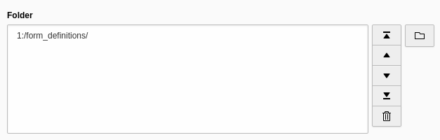

.. include:: ../../Includes.txt

.. _fields-folder:

Folder
======

.. important::

   Only available for TYPO3 v12 or higher. For TYPO3 v11 or lower use type
   :ref:`Group <fields-group>` with `internal_type` set to `folder`.

.. figure:: ../../Images/FieldTypes/Folder.svg
   :alt: Folder
   :class: float-left
   :width: 64px

Select one or more folders in a folder browse window.

.. rst-class::  clear-both

.. code-block:: php

   'type' => 'folder'

   Folder field

Available TCA options
---------------------

*  :ref:`config.elementBrowserEntryPoints <t3tca:columns-folder-properties-elementBrowserEntryPoints>`
*  :ref:`config.minitems <t3tca:tca_property_minitems>`
*  :ref:`config.maxitems <t3tca:tca_property_maxitems>`
*  :ref:`l10n_mode <t3tca:columns-properties-l10n-mode>`
*  :ref:`config.behaviour.allowLanguageSynchronization <t3tca:tca_property_behaviour_allowLanguageSynchronization>`
*  :ref:`config.size <t3tca:tca_property_size>`
*  :ref:`config.autoSizeMax <t3tca:tca_property_autoSizeMax>`
*  :ref:`config.multiple <t3tca:tca_property_multiple>`

See a complete overview of Folder TCA options in the :ref:`official documentation <t3tca:columns-folder>`.
