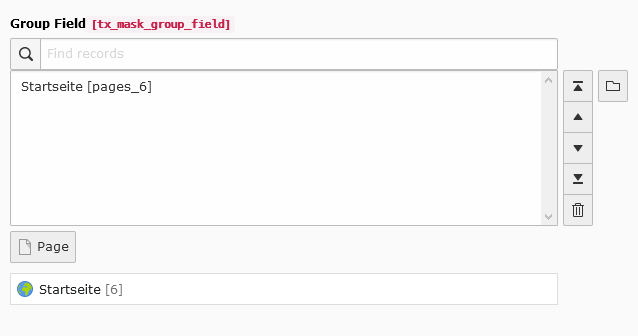

.. include:: ../../Includes.txt

.. _fields-group:

Group
=====

Select with relation to one or more other database tables.

.. rst-class::  clear-both

.. code-block:: php

   'type' => 'group'

   Group field

Available TCA options
---------------------

*  :ref:`config.internal_type <t3tca:columns-group-properties-internal-type>`
*  :ref:`config.allowed <t3tca:columns-group-properties-allowed>`
*  :ref:`config.minitems <t3tca:tca_property_minitems>`
*  :ref:`config.maxitems <t3tca:tca_property_maxitems>`
*  :ref:`config.fieldControl.editPopup <t3tca:tca_property_fieldControl_editPopup>`
*  :ref:`config.fieldControl.addRecord <t3tca:tca_property_fieldControl_addRecord>`
*  :ref:`config.fieldControl.listModule <t3tca:tca_property_fieldControl_listModule>`
*  :ref:`config.fieldControl.elementBrowser <t3tca:columns-group-properties-elementBrowser>`
*  :ref:`config.fieldControl.insertClipboard <t3tca:tca_property_fieldControl_insertClipboard>`
*  :ref:`config.fieldWizard.recordsOverview <t3tca:tca_property_fieldWizard_recordsOverview>`
*  :ref:`config.fieldWizard.tableList <t3tca:tca_property_fieldWizard_tableList>`
*  :ref:`l10n_mode <t3tca:columns-properties-l10n-mode>`
*  :ref:`config.behaviour.allowLanguageSynchronization <t3tca:tca_property_behaviour_allowLanguageSynchronization>`
*  :ref:`config.size <t3tca:tca_property_size>`
*  :ref:`config.autoSizeMax <t3tca:tca_property_autoSizeMax>`
*  :ref:`config.multiple <t3tca:tca_property_multiple>`

See a complete overview of Group TCA options in the :ref:`official documentation <t3tca:columns-group>`.
