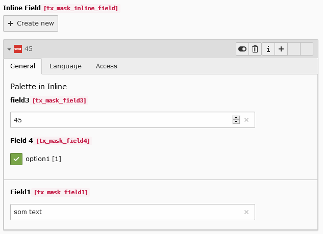

.. include:: ../../Includes.txt

.. _fields-inline:

Inline (Repeating)
==================

Repeating field, using IRRE technique. You can add repeating subfields to this item.
Example: Create a slider with multiple slides.

.. rst-class::  clear-both

.. code-block:: php

   'type' => 'inline'

   Inline field

Available TCA options
---------------------

*  :ref:`ctrl.label <t3tca:ctrl-reference-label>`
*  :ref:`ctrl.iconfile <t3tca:ctrl-reference-iconfile>`
*  :ref:`config.minitems <t3tca:tca_property_minitems>`
*  :ref:`config.maxitems <t3tca:tca_property_maxitems>`
*  :ref:`config.appearance.newRecordLinkTitle <t3tca:columns-inline-properties-appearance>`
*  :ref:`config.appearance.levelLinksPosition <t3tca:columns-inline-properties-appearance>`
*  :ref:`config.appearance.showNewRecordLink <columns-inline-properties-showNewRecordLink>` (only v11 or higher)
*  :ref:`config.appearance.collapseAll <t3tca:columns-inline-properties-appearance>`
*  :ref:`config.appearance.expandSingle <t3tca:columns-inline-properties-appearance>`
*  :ref:`config.appearance.useSortable <t3tca:columns-inline-properties-appearance>`
*  :ref:`config.appearance.enabledControls <t3tca:columns-inline-properties-appearance>`
*  :ref:`l10n_mode <t3tca:columns-properties-l10n-mode>`
*  :ref:`config.behaviour.allowLanguageSynchronization <t3tca:tca_property_behaviour_allowLanguageSynchronization>`
*  :ref:`config.appearance.showPossibleLocalizationRecords <t3tca:columns-inline-properties-appearance>`
*  :ref:`config.appearance.showAllLocalizationLink <t3tca:columns-inline-properties-appearance>`
*  :ref:`config.appearance.showSynchronizationLink <t3tca:columns-inline-properties-appearance>`

See a complete overview of Inline TCA options in the :ref:`official documentation <t3tca:columns-inline>`.
