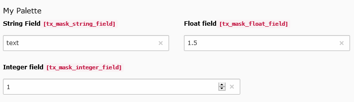

.. include:: ../../Includes.txt

.. _fields-linebreak:

Linebreak
=========

For use in conjunction with :ref:`Palettes <fields-palette>` only. They allow you to add a linebreak between two fields in a palette, if there
is too little space to fit them all in one line.

.. rst-class::  clear-both

   Linebreak field

Official Documentation
----------------------

Read about linebreaks in the :ref:`official documentation <t3tca:palettes-linebreaks>`.
