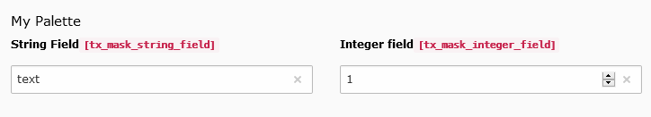

.. include:: ../../Includes.txt

.. _fields-palette:

Palette
=======

Palettes allow you to group multiple fields. They will by default be shown next to each other.

.. rst-class::  clear-both

   Palette field

Official Documentation
----------------------

Read about palettes in the :ref:`official documentation <t3tca:palettes>`.
