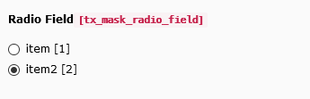

.. include:: ../../Includes.txt

.. _fields-radio:

Radiobutton
===========

One or more radiobuttons.

.. rst-class::  clear-both

.. code-block:: php

   'type' => 'radio'

   Radio field

Available TCA options
---------------------

*  :ref:`config.items <t3tca:columns-radio-properties-items>`
*  :ref:`config.default <t3tca:tca_property_default>`
*  :ref:`l10n_mode <t3tca:columns-properties-l10n-mode>`
*  :ref:`config.behaviour.allowLanguageSynchronization <t3tca:tca_property_behaviour_allowLanguageSynchronization>`

See a complete overview of Radio TCA options in the :ref:`official documentation <t3tca:columns-radio>`.
