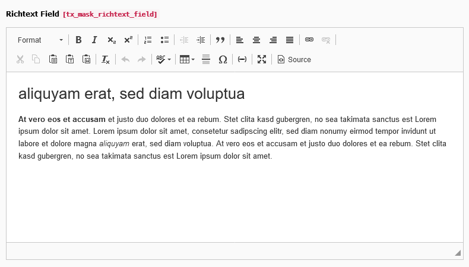

.. include:: ../../Includes.txt

.. _fields-richtext:

Richtext
========

A multiline textfield with richtext editor.

.. rst-class::  clear-both

.. code-block:: php

   'type' => 'text',
   'enableRichtext' => true

   Richtext field

Available TCA options
---------------------

*  :ref:`config.richtextConfiguration <t3tca:columns-text-properties-richtextConfiguration>`
*  :ref:`config.default <t3tca:tca_property_default>`
*  :ref:`l10n_mode <t3tca:columns-properties-l10n-mode>`
*  :ref:`config.behaviour.allowLanguageSynchronization <t3tca:tca_property_behaviour_allowLanguageSynchronization>`

See a complete overview of Richtext TCA options in the :ref:`official documentation <t3tca:columns-text-properties-enableRichtext>`.
