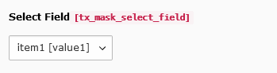

.. include:: ../../Includes.txt

.. _fields-select:

Selectbox
=========

Selectbox with own values or relation to other database table.

.. rst-class::  clear-both

.. code-block:: php

   'type' => 'select'

   Select field

Available TCA options
---------------------

*  :ref:`config.renderType <t3tca:columns-select-introduction>`
*  :ref:`config.default <t3tca:tca_property_default>`
*  :ref:`config.items <t3tca:columns-select-properties-items>`
*  :ref:`config.itemGroups <t3tca:columns-select-properties-item-groups>`
*  :ref:`config.sortItems <t3tca:columns-select-properties-sort-items>`
*  :ref:`config.minitems <t3tca:tca_property_minitems>`
*  :ref:`config.maxitems <t3tca:tca_property_maxitems>`
*  :ref:`config.foreign_table <t3tca:columns-select-properties-foreign-table>`
*  :ref:`config.foreign_table_where <t3tca:columns-select-properties-foreign-table-where>`
*  :ref:`config.fileFolder <t3tca:columns-select-properties-filefolder>` (v10)
*  :ref:`config.fileFolder_extList <t3tca:columns-select-properties-filefolder-extlist>` (v10)
*  :ref:`config.fileFolder_recursions <t3tca:columns-select-properties-filefolder-recursions>` (v10)
*  :ref:`config.fileFolderConfig.folder <t3tca:columns-select-properties-fileFolderConfig.folder>` (v11)
*  :ref:`config.fileFolderConfig.allowedExtensions <t3tca:columns-select-properties-fileFolderConfig-allowedExtensions>` (v11)
*  :ref:`config.fileFolderConfig.depth <t3tca:columns-select-properties-fileFolderConfig-depth>` (v11)
*  :ref:`config.fieldWizard.selectIcons <t3tca:tca_property_fieldWizard_selectIcons>`
*  :ref:`l10n_mode <t3tca:columns-properties-l10n-mode>`
*  :ref:`config.behaviour.allowLanguageSynchronization <t3tca:tca_property_behaviour_allowLanguageSynchronization>`
*  :ref:`config.size <t3tca:tca_property_size>`
*  :ref:`config.autoSizeMax <t3tca:tca_property_autoSizeMax>`
*  :ref:`config.appearance.expandAll <t3tca:columns-select-properties-appearance-selectCheckBox>`

See a complete overview of Select TCA options in the :ref:`official documentation <t3tca:columns-select-introduction>`.
