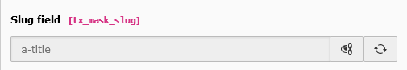

.. include:: ../../Includes.txt

.. _fields-slug:

Slug
====

.. figure:: ../../Images/FieldTypes/Slug.svg
   :alt: Slug
   :class: float-left
   :width: 64px

The slug field can create a unique identifier per content element, which can be
used for the HTML id property or other use cases.

.. rst-class::  clear-both

.. code-block:: php

   'type' => 'slug'

   Slug field

Available TCA options
---------------------

*  :ref:`config.eval.slug <t3tca:columns-slug-properties-eval>`
*  :ref:`config.generatorOptions.fields <t3tca:columns-slug-properties-generatorOptions>`
*  :ref:`config.generatorOptions.replacements <t3tca:columns-slug-properties-generatorOptions>`
*  :ref:`config.generatorOptions.fieldSeparator <t3tca:columns-slug-properties-generatorOptions>`
*  :ref:`config.fallbackCharacter <t3tca:columns-slug-properties-fallbackCharacter>`
*  :ref:`config.prependSlash <t3tca:columns-slug-properties-prependSlash>`

See a complete overview of Slug TCA options in the :ref:`official documentation <t3tca:columns-slug>`.
