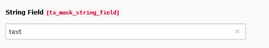

.. include:: ../../Includes.txt

.. _fields-string:

String
======

A simple input field for a short line of text.

.. rst-class::  clear-both

.. code-block:: php

   'type' => 'input'

   String field

Available TCA options
---------------------

*  :ref:`config.default <t3tca:tca_property_default>`
*  :ref:`config.placeholder <t3tca:tca_property_placeholder>`
*  :ref:`config.size <t3tca:columns-input-properties-size>`
*  :ref:`config.max <t3tca:columns-input-properties-max>`
*  :ref:`config.is_in <t3tca:columns-input-properties-is-in>`
*  :ref:`config.eval.required <t3tca:columns-input-properties-eval>`
*  :ref:`config.eval.trim <t3tca:columns-input-properties-eval>`
*  :ref:`config.eval.alpha <t3tca:columns-input-properties-eval>`
*  :ref:`config.eval.num <t3tca:columns-input-properties-eval>`
*  :ref:`config.eval.alphanum <t3tca:columns-input-properties-eval>`
*  :ref:`config.eval.alphanum_x <t3tca:columns-input-properties-eval>`
*  :ref:`config.eval.domainname <t3tca:columns-input-properties-eval>`
*  :ref:`config.eval.email <t3tca:columns-input-properties-eval>`
*  :ref:`config.eval.lower <t3tca:columns-input-properties-eval>`
*  :ref:`config.eval.upper <t3tca:columns-input-properties-eval>`
*  :ref:`config.eval.unique <t3tca:columns-input-properties-eval>`
*  :ref:`config.eval.uniqueInPid <t3tca:columns-input-properties-eval>`
*  :ref:`config.eval.nospace <t3tca:columns-input-properties-eval>`
*  :ref:`l10n_mode <t3tca:columns-properties-l10n-mode>`
*  :ref:`config.behaviour.allowLanguageSynchronization <t3tca:tca_property_behaviour_allowLanguageSynchronization>`
*  :ref:`config.eval.null <t3tca:columns-input-properties-eval>`
*  :ref:`config.mode <t3tca:tca_property_mode>`
*  :ref:`config.eval.md5 <t3tca:columns-input-properties-eval>`
*  :ref:`config.eval.password <t3tca:columns-input-properties-eval>`
*  :ref:`config.autocomplete <t3tca:columns-input-properties-autocomplete>`

See a complete overview of String TCA options in the :ref:`official documentation <t3tca:columns-input-renderType-default>`.
