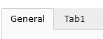

.. include:: ../../Includes.txt

.. _fields-tab:

Tab
===

With the tab field, you can add a tab divider to better organize your fields in several tabs, and make editor's life
easier.

.. rst-class::  clear-both

   Tab field

Official Documentation
----------------------

Read about tabs in the :ref:`official documentation <t3tca:types-properties-showitem>`.
