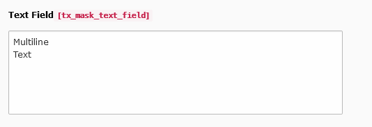

.. include:: ../../Includes.txt

.. _fields-text:

Text
====

A multiline textfield.

.. rst-class::  clear-both

.. code-block:: php

   'type' => 'text'

   Text field

Available TCA options
---------------------

*  :ref:`config.default <t3tca:tca_property_default>`
*  :ref:`config.placeholder <t3tca:tca_property_placeholder>`
*  :ref:`config.cols <t3tca:columns-text-properties-cols>`
*  :ref:`config.rows <t3tca:columns-text-properties-rows>`
*  :ref:`config.max <t3tca:columns-input-properties-max>`
*  :ref:`config.eval.required <t3tca:columns-text-properties-eval>`
*  :ref:`config.eval.trim <t3tca:columns-text-properties-eval>`
*  :ref:`l10n_mode <t3tca:columns-properties-l10n-mode>`
*  :ref:`config.behaviour.allowLanguageSynchronization <t3tca:tca_property_behaviour_allowLanguageSynchronization>`
*  :ref:`config.format <t3tca:columns-text-properties-format>`
*  :ref:`config.eval.null <t3tca:columns-text-properties-eval>`
*  :ref:`config.mode <t3tca:tca_property_mode>`
*  :ref:`config.fixedFont <t3tca:columns-text-properties-fixedFont>`
*  :ref:`config.enableTabulator <t3tca:columns-text-properties-enableTabulator>`
*  :ref:`config.wrap <t3tca:columns-text-properties-wrap>`

See a complete overview of Text TCA options in the :ref:`official documentation <t3tca:columns-text>`.
