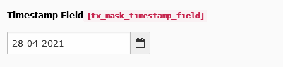

.. include:: ../../Includes.txt

.. _fields-timestamp:

Timestamp
=========

An input field for a date (stored as UNIX timestamp).

.. rst-class::  clear-both

.. code-block:: php

   'type' => 'input',
   'renderType' => 'inputDateTime'

   Timestamp field

Available TCA options
---------------------

*  :ref:`config.eval <columns-input-renderType-inputDateTime-eval>`
*  :ref:`config.default <t3tca:tca_property_default>`
*  :ref:`config.placeholder <t3tca:tca_property_placeholder>`
*  :ref:`config.range.lower <t3tca:columns-input-datetime-properties-range>`
*  :ref:`config.range.upper <t3tca:columns-input-datetime-properties-range>`
*  :ref:`config.eval.required <t3tca:columns-input-properties-eval>`
*  :ref:`l10n_mode <t3tca:columns-properties-l10n-mode>`
*  :ref:`config.behaviour.allowLanguageSynchronization <t3tca:tca_property_behaviour_allowLanguageSynchronization>`
*  :ref:`config.eval.null <t3tca:columns-input-properties-eval>`
*  :ref:`config.mode <t3tca:tca_property_mode>`

See a complete overview of Timestamp TCA options in the :ref:`official documentation <t3tca:columns-input-renderType-inputDateTime>`.
