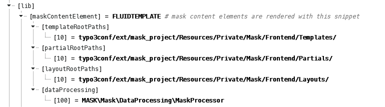

.. include:: ../Includes.txt

.. _fsc-guide:

============================
Fluid Styled Content Layouts
============================

This guide describes, how you can extend your mask templates with the layout from `fluid_styled_content`.
Works for TYPO3 v8 / Mask v4 and higher.

You probably know, that fluid styled content (from now on abbreviated FSC) adds special wrappers for its content
elements like this:

::

   

These are very helpful, because you can use the anchor id and spacing classes of FSC. In order to
wrap all your templates with such a layout you have to provide the FSC layout paths for `lib.maskContentElement`.

Let's have a look at the contents of this TypoScript object:

   The contents of lib.maskContentElement

As you can see `lib.maskContentElement` is a `FLUIDTEMPLATE` content object. Mask dynamically generates this TypoScript
with the root paths you have defined in the :ref:`extension settings <extension-settings-frontent-templates>`. Mask is
using the key `10` for its paths. So all you have to do is to provide a lower key and point to the FSC paths in your
TypoScript template like this:

::

   lib.maskContentElement {
       partialRootPaths.0 < lib.contentElement.partialRootPaths.0
       layoutRootPaths.0 < lib.contentElement.layoutRootPaths.0

       settings < lib.contentElement.settings
   }

The FSC `lib.contentElement` is the equivalent to `lib.maskContentElement`. You can see where Mask got its inspiration
from :). By adding the FSC settings, these will also be available in your Mask templates.

.. important::
   Higher keys override lower keys. If you would add higher keys, they will always override your Mask Layouts and
   Partials, which you probably don't want.

Now the setup is complete and all what's left to do is to use the newly available layout in your templates.

::

   <f:layout/>

   <f:section name="Header"/>

   <f:section name="Main">
       <!-- Your content -->
   </f:section>

This is of course completely optional and you can just remove this per element if you need to. The additional empty
:html:`<f:section name="Header"/>` is important: This removes the :html:`<header>` partial which FSC would add to your
template. If you need this anyway, you can just remove it.

.. important::
   :html:`<f:layout/>` is the same as :html:`<f:layout name="Default"/>`. If you also have a Layout with the name
   `Default.html` defined in your layout root path, this will override the FSC Layout.

Special thanks to Lars (Nitori), who explained this all in detail `here <https://github.com/Gernott/mask/issues/242>`__.
