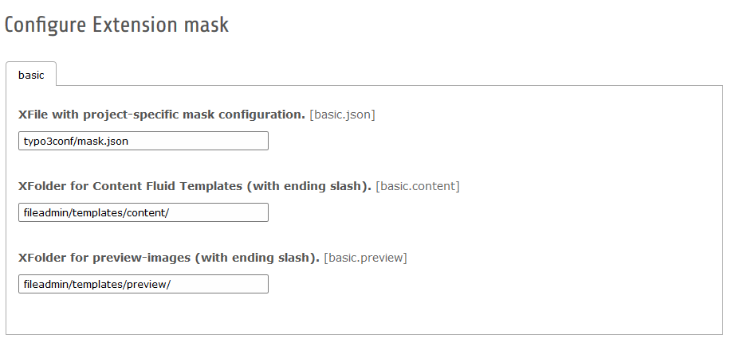

.. ==================================================
.. FOR YOUR INFORMATION
.. --------------------------------------------------
.. -*- coding: utf-8 -*- with BOM.

.. include:: ../Includes.txt

.. _admin-manual:

Administrator Manual
====================

Target group: **Administrators**

.. _admin-installation:

Installation
------------

To install the extension, perform the following steps:

#. Import and install the Extension in the TYPO3-Backend in Module **Extensionmanager**.

#. Include static template **Content Elements (fluid_styled_content)** first and after it **Mask (mask)** in Module **Template** in your main TypoScript-Template.

.. figure:: ../Images/AdministratorManual/TypoScriptTemplate.png
   :alt: Include TypoScript Template

   Include TypoScript Template

After installation, check the extension settings:

File with project specific mask configuration. [general.json]
  Mask stores the information, which is needed to generate contentelements and extend pagetemplates into one file: mask.json. With this setting you can change the path to this file.

  Default is: typo3conf/mask.json

Folder for Content Fluid Templates (with trailing slash). [frontend.content]
  Mask generates a html file with fluid tags for each new contentelement. Here you can set the path to this file.

  Default is: fileadmin/templates/content/

Folder for Content Fluid Layouts (with trailing slash). [frontend.layouts]
  Here you can set the path to the fluid layouts of your mask templates

  Default is: fileadmin/templates/content/Layouts

Folder for Content Fluid Partials (with trailing slash). [frontend.partials]
  Here you can set the path to the fluid partials of your mask templates

  Default is: fileadmin/templates/content/Partials

Folder for Backend Preview Templates (with trailing slash). [backend.backend]
  Here you can set the path the fluid templates for backend previews of your content elements.

  Default is: fileadmin/templates/backend/

Folder for Backend Preview Layouts (with trailing slash). [backend.layouts_backend]
  Here you can set the path to the fluid layouts of your mask backend previews

  Default is: fileadmin/templates/backend/Layouts

Folder for Backend Preview Partials (with trailing slash). [backend.partials_backend]
  Here you can set the path to the fluid partials of your mask backend previews

  Default is: fileadmin/templates/backend/Partials

Folder for preview images (with trailing slash). [backend.preview]
   You can change the preview image to your prefered image or icon. Here you can set the path to the preview images.

  Default is: fileadmin/templates/preview/

   Extension Manager options
