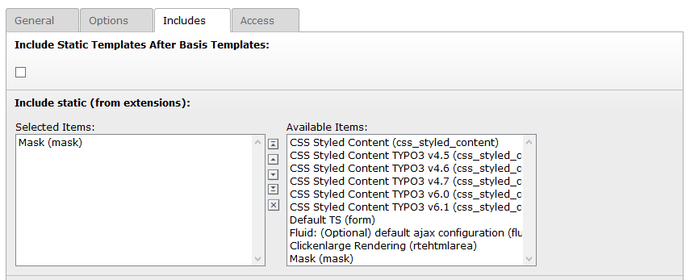

.. include:: ../Includes.txt

.. _installation:

============
Installation
============

.. note::
   Before you start using mask, you should have set up your :ref:`sitepackage<sitepackage>`.

Preparations
============

It is important to add Mask as a dependency in your `ext_emconf.php` of your
sitepackage. This ensures, Mask is loaded **before** your Theme extension. Only
then, you can override the generated TCA from Mask in your Overrides folder.

.. code-block:: php

   $EM_CONF[$_EXTKEY] = [
       'constraints' => [
           'depends' => [
               'mask' => '' // Add the minimum version here or leave blank for any version.
           ]
       ]
   ];

For composer installations also add the requirement to your extension's
`composer.json` file. In TYPO3 v11 the `ext_emconf.php` file is not even needed
anymore, when in composer mode.

.. code-block:: json

   {
      "require": {
         "mask/mask": "^7"
      }
   }

.. note::

   If you add the dependency after Mask is already installed and activated, you
   need to rebuild the loading order by reinstalling your extension.

Install and configure
=====================

.. rst-class:: bignums

   1. Download Mask with composer by running the command `composer require mask/mask` or install via extension manager.

   2. Activate Mask in the extension manager (not needed in TYPO3 v11 composer mode)

   3. Mask requires `fluid_styled_content` so go to your static includes in the template module and include it there.

      :ref:`Read here how to include static templates <t3sitepackage:typo3-backend-typoscript-template>`

      | You can install this core extension in composer mode with the command
      | `composer require typo3/cms-fluid-styled-content`

   4. Also include the Mask static TypoScript.

   5. Navigate to the Mask module and enter your sitepackage extension key for auto-configuration (your extension must be loaded!).

   6. Start creating your own content elements!

Manual configuration
====================

If you don't want to use the default folder structure created by the auto-configuration, you can adjust every path in
the :ref:`extension configuration <extension-settings>` of Mask.

.. tip::

   It is great to have the `LocalConfiguration.php` file (where the extension configuration is stored)
   in version control so others will have this already set up when checking out the project.

Screenshots
===========

   Include TypoScript Template

.. versionadded:: 7.1.0

.. figure:: ../Images/Mask7.1/AutoConfiguration.png
   :alt: Mask auto-configuration
   :class: with-border

   Mask warns you about missing configuration
