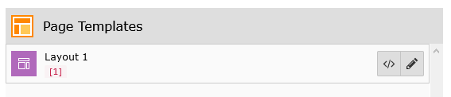
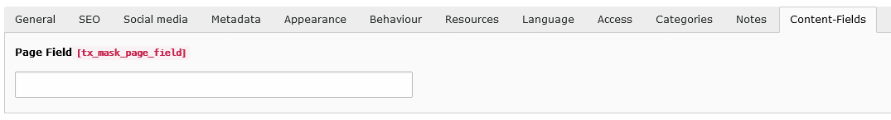
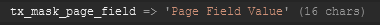

.. include:: ../Includes.txt

.. _configuration:

==============
Page templates
==============

Page templates or to be precise :ref:`backend layouts<t3coreapi:be-layout>` define the structure of your page. You can
configure rows and cols so that the page module looks similar to the frontend output of your site.

Mask is able to extend your page record depending on the currently selected backend layout. This means new fields will
be available if you click on edit page. The data defined there can then be used in your fluid templates of your
sitepackage. The page record is not available by default in mask elements!

Mask does not create any backend layouts. You have to do it by yourself. There are 2 different methods:

*  Go to the list module and create a new Backend Layout record
*  Define your Backend Layouts with TSconfig (recommended)

Mask will know about all your database backend layouts. The ones defined by
TSconfig will only be found, if they are within the rootline of the pids defined
in the :ref:`extension settings<extension-settings-pids>`. By default this value
is `0`, thus all will be found.

   Mask found a backend layout record with the name Layout and key 1

Now the procedure is the same as for :ref:`creating content elements<create-content-elements>`. The only difference is,
that you can't create new backend layouts in mask. So you can only edit existing backend layouts. All the meta data
like label, key and icon have to be defined by yourself.

After saving your fields, you will find a new tab `Content-Fields` when editing the page record, which have the
according backend layout assigned (or inherits from).

   Mask adds the new tab Content-Fields with the defined fields

The data you put there can be accessed inside of your template for the backend layout. Again, this is not available in
Mask elements by default.

   Debug of the data array (page record) with the new field
