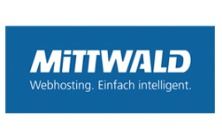
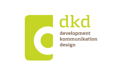
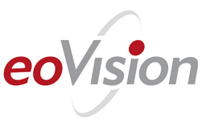
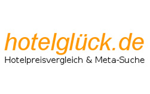
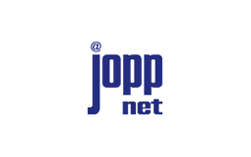
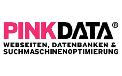
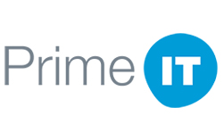
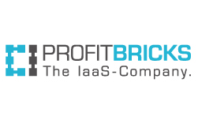
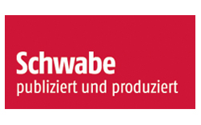

.. include:: ../Includes.txt

Sponsors
========

Mask was supported by great sponsors! Thank you very much!
We started Mask for our customers and used it only internally. Creating new fields always had to be done by hand
(create SQL/TCA,...). Then we got the idea to create a comfortable wizard to create such things easier and make this
public. We searched for financial support and discovered crowdfunding. On `startnext <https://www.startnext.com/mask/>`_
we created our project.

List of main sponsors
---------------------

List of logo sponsors
---------------------

.. figure:: ../Images/SponsorsManual/sitedesign.jpg
   :alt: Sitedesign
   :target: http://www.sitedesign.at
   :class: float-left
   :width: 148px

List of further sponsors
------------------------

*  Roland Klein
*  Johannes Reß
*  René Carolus
*  Korbinian Kugelmann

GitHub sponsors
---------------

*  `Krystian Szymukowicz <https://github.com/kszymukowicz>`__
*  `Elementare Teilchen <https://github.com/ElementareTeilchen>`__
*  `Birger Fühne <https://github.com/bfuhne>`__
*  `Guido Schmechel <https://github.com/ayacoo>`__
*  `Wolfgang Wagner <https://github.com/wowaTYPO3>`__
*  `Michael Paulisch <https://github.com/micha68g>`__
*  `Eric Bode <https://github.com/EricBode>`__
*  `Sascha Bucher <https://github.com/sabuch>`__
*  `Axel Hempelt <https://github.com/hempelta>`__
