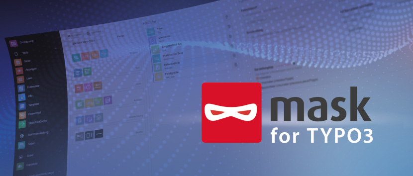

# TYPO3 extension `mask` :performing_arts:

Mask is a content element builder that generates TypoScript, TSconfig and TCA on
the fly. You can build your own custom content elements in a user-friendly
backend module via drag and drop. Your configuration is stored in json files,
which can be shared across projects.

Mask provides different field types, that you can use to
customize your content elements. Depending on the type there are different
options available. Field types are grouped roughly into input, repeating and
structural fields. With these given tools, you can cover almost all typical
requirements for your projects. And if not, Mask can be extended
via TCA overrides or DataProcessors.

|                  | URL                                            |
|------------------|------------------------------------------------|
| **Repository:**  | https://github.com/Gernott/mask                |
| **Read online:** | https://docs.typo3.org/p/mask/mask/main/en-us/ |
| **TER:**         | https://extensions.typo3.org/extension/mask    |

## Quickstart :rocket:

1. Add Mask as a dependency in your `ext_emconf.php` and/or `composer.json` of your sitepackage.
2. Download Mask with composer by running the command `composer require mask/mask` or install via extension manager.
3. Activate Mask in the extension manager (not needed in TYPO3 v11 composer mode).
4. Mask requires `fluid_styled_content` so go to your static includes in the template module and include it there.
5. Also include the Mask static TypoScript.
6. Navigate to the Mask module and enter your sitepackage extension key for auto-configuration (your extension must be loaded!).
7. Start creating your own content elements!

## Manual configuration :pencil2:

If you don't want to use the default folder structure created by the auto-configuration, you can adjust every path in
the extension configuration of Mask.

## Advantages of Mask :white_check_mark:

* Mask stores the content in columns in database tables – not as XML (Flexform)
* Mask reuses existing database fields to conserve the database
* Mask works only with existing features of the TYPO3 core: backend layouts, Fluid, TypoScript
* Silent TCA migrations allow for easy TYPO3 upgrades to new major versions
* Mask allows repeating content with IRRE technology
* Mask supports multi-language projects
* Mask supports workspaces and versioning
* The Mask backend is a single page application based on VueJS for even more comfort

Read a detailed explanation for each advantage and why to use Mask over other alternatives in the [official documentation](https://docs.typo3.org/p/mask/mask/main/en-us/Introduction/Index.html).

## Mask versions :calendar:

| Mask Version | TYPO3 Version | Release Date | Status              | More Info                                                                                              |
|--------------|---------------|--------------|---------------------|--------------------------------------------------------------------------------------------------------|
| v8.0         | v11, v12      | March 2023   | development         | Compatibility TYPO3 v12                                                                                |
| v7.2         | v10, v11      | 2022-05-25   | regular maintenance | [New field types, improved UX](https://docs.typo3.org/p/mask/mask/main/en-us/ChangeLog/7.2/Index.html) |
| v7.1         | v10, v11      | 2021-12-14   | discontinued        | [JsonSplitLoader, new API](https://docs.typo3.org/p/mask/mask/main/en-us/ChangeLog/7.1/Index.html)     |
| v7.0         | v10, v11      | 2021-05-12   | discontinued        | [VueJS based Mask Backend](https://docs.typo3.org/p/mask/mask/main/en-us/ChangeLog/7.0/Index.html)     |
| v6           | v10, v11.1    | 2020-10-08   | discontinued        | [Palettes, Groups and more](https://docs.typo3.org/p/mask/mask/main/en-us/ChangeLog/6.0/Index.html)    |
| v5           | v10           | 2020-04-18   | discontinued        | Please update to v7                                                                                    |
| v4           | v9            | 2018-10-04   | discontinued        |                                                                                                        |
| v3           | v8            | 2017-05-23   | discontinued        |                                                                                                        |
| v2           | v7            | 2016-05-10   | discontinued        |                                                                                                        |
| v1           | v6, v7        | 2015-08-12   | discontinued        |                                                                                                        |

## Need help? :left_speech_bubble:

* Read how to install, configure and use mask in the [official documentation](https://docs.typo3.org/p/mask/mask/main/en-us/)
* Join the "#ext-mask" channel on [TYPO3 Slack](https://typo3.slack.com/archives/C0FD5F6P2) and ask the mask community.
* [Visit our website](https://mask.webprofil.at) to find more information about mask

## Found a bug? :boom:

* First check out the main branch and verify that the issue is not yet solved
* Have a look at the existing [issues](https://github.com/gernott/mask/issues/), to prevent duplicates
* If not found, report the bug in our [issue tracker](https://github.com/gernott/mask/issues/new/)

## Like a new feature? :bulb:

* Have a look at our [project page](https://github.com/Gernott/mask/projects/1)
* If your idea is not listed here, get in [contact](https://mask.webprofil.at/imprint/) with us
* If you want to sponsor a feature, get in [contact](https://mask.webprofil.at/imprint/) with us
* If you want to develop a feature, get in [contact](https://mask.webprofil.at/imprint/) to plan a strategy

## [Sponsors](https://docs.typo3.org/p/mask/mask/main/en-us/Sponsors/Index.html) :handshake:

See a list of all [sponsors](https://docs.typo3.org/p/mask/mask/main/en-us/Sponsors/Index.html), who helped Mask to
become what it is today.
