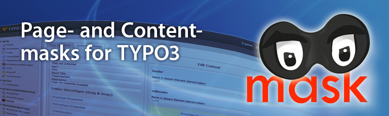

# mask

Create your own content elements and page templates. Easy to use, even without programming skills because of the comfortable drag and drop user interface. All content is stored in structured database tables.

## What does it do?

Mask is a TYPO3 extension for creating content elements and extending page templates. It’s possible to add new fields to any element. Fields can have several types, for example: text, file, relations, rich text, ...

## Advantages of Mask

* Mask stores the content in columns in database tables – not as XML (Flexform)
* Mask reuses existing database fields to conserve the database
* Mask works only with existing features of the TYPO3 core: backend layouts, Fluid, TypoScript
* Mask allows repeating content with IRRE technology
* Mask supports multi language projects and resolves some language bugs of TYPO3
* Mask supports workspaces and versioning
* Mask is written in Extbase, the modern way to create extensions

## Need help?

* Read how to install, configure and use mask in the [official documentation](https://docs.typo3.org/typo3cms/extensions/mask/)
* [Visit our website](http://mask.webprofil.at) to find more information about mask.

## Found a bug?
* first check out the master branch and verify that the issue is not yet solved
* have a look at the existing [issues](https://github.com/Gernott/mask/issues/), to prevent duplicates
* if not found, report the bug in our [issue tracker](https://github.com/Gernott/mask/issues/new/)

## Like a new feature?
* have a look at our [wishlist](http://mask.webprofil.at/featurelist/overview/)
* if your idea is not listed here, get in [contact](http://mask.webprofil.at/imprint/) with us
* if you want to sponsor a feature, get in [contact](http://mask.webprofil.at/imprint/) with us
* if you want to develop a feature, get in [contact](http://mask.webprofil.at/imprint/) to plan a strategy
